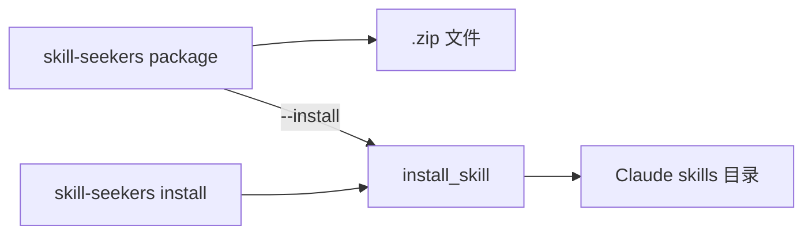
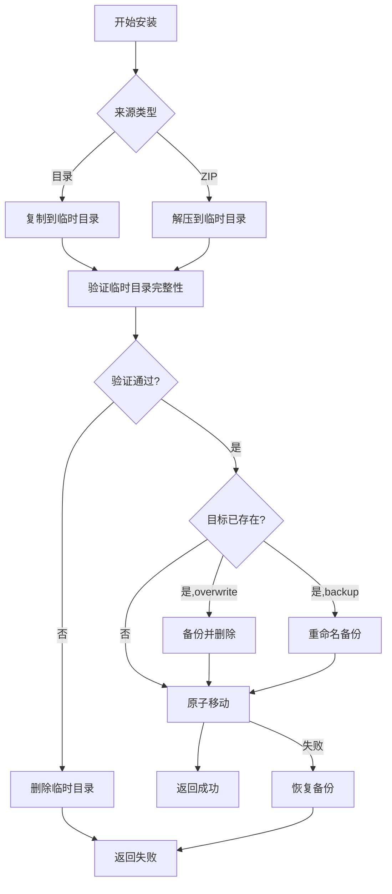

# Design: Local Skill Install

## 架构概览



## 目录解析策略

### 优先级顺序

1. **环境变量** `CLAUDE_SKILLS_DIR`（优先）
2. **平台默认路径**：
   - **Windows**: `%APPDATA%\Claude\skills` 或 `%USERPROFILE%\.claude\skills`
   - **macOS**: `~/Library/Application Support/Claude/skills` 或 `~/.claude/skills`
   - **Linux**: `~/.claude/skills` 或 `$XDG_DATA_HOME/Claude/skills`

### 路径解析函数

```python
def get_claude_skills_dir() -> Path:
    """获取 Claude skills 目录，支持跨平台"""
    # 1. 环境变量优先
    if env_dir := os.environ.get("CLAUDE_SKILLS_DIR"):
        return Path(env_dir).expanduser().resolve()
    
    # 2. 平台默认
    if sys.platform == "win32":
        appdata = os.environ.get("APPDATA")
        if appdata:
            claude_dir = Path(appdata) / "Claude" / "skills"
            if claude_dir.exists():
                return claude_dir
        return Path.home() / ".claude" / "skills"
    
    elif sys.platform == "darwin":
        app_support = Path.home() / "Library" / "Application Support" / "Claude" / "skills"
        if app_support.exists():
            return app_support
        return Path.home() / ".claude" / "skills"
    
    else:  # Linux
        xdg = os.environ.get("XDG_DATA_HOME", str(Path.home() / ".local" / "share"))
        xdg_dir = Path(xdg) / "Claude" / "skills"
        if xdg_dir.exists():
            return xdg_dir
        return Path.home() / ".claude" / "skills"
```

## 冲突处理策略

| 选项 | 行为 | 使用场景 |
|------|------|----------|
| 默认 | 失败并提示 | 防止意外覆盖 |
| `--overwrite` | 删除后复制 | 明确更新 |
| `--backup` | 备份为 `<name>-backup-<timestamp>` | 保留历史 |
| `--dry-run` | 仅显示操作 | 预览验证 |

## 验证流程

安装前验证：
1. 检查 `SKILL.md` 是否存在
2. 验证技能目录结构完整性
3. 检测目标目录权限

## 错误处理

- **权限不足**：提示以管理员/sudo 运行
- **复制中断**：回滚（删除不完整的目录或恢复备份）
- **路径问题**：处理空格、Unicode 字符、大小写不敏感文件系统

## 接口设计

### CLI 接口

```bash
# 独立安装命令
skill-seekers install <skill_dir_or_zip> [--target <dir>] [--overwrite] [--backup] [--dry-run]

# 打包后安装
skill-seekers package <skill_dir> --install [--target <dir>] [--overwrite]
```

### Python API

```python
def install_skill(
    source: Path,
    target_dir: Optional[Path] = None,
    overwrite: bool = False,
    backup: bool = False,
    dry_run: bool = False,
) -> Tuple[bool, Path]:
    """
    安装技能到 Claude skills 目录
    
    Args:
        source: 技能目录或 .zip 文件路径
        target_dir: 目标目录（默认自动检测）
        overwrite: 覆盖已存在的同名技能
        backup: 备份已存在的同名技能
        dry_run: 预览模式，不实际执行
    
    Returns:
        (success, installed_path)
    """
```

## 原子性安装策略

为防止安装中断导致部分状态，采用"先临时后移动"策略：



```python
import shutil
import tempfile

def _atomic_install(source_path: Path, target_path: Path) -> None:
    """原子性安装：先复制到临时目录，再移动到目标"""
    with tempfile.TemporaryDirectory(dir=target_path.parent) as tmp_dir:
        tmp_path = Path(tmp_dir) / source_path.name
        
        if source_path.suffix == '.zip':
            _safe_extract_zip(source_path, tmp_path)
        else:
            shutil.copytree(source_path, tmp_path)
        
        # 验证 SKILL.md 存在
        if not (tmp_path / "SKILL.md").exists():
            raise ValueError("Invalid skill: SKILL.md not found")
        
        # 原子移动
        shutil.move(str(tmp_path), str(target_path))
```

## ZIP 安全验证

```python
import zipfile

def _safe_extract_zip(zip_path: Path, target_dir: Path) -> None:
    """安全解压 ZIP，防止路径穿越和危险条目"""
    with zipfile.ZipFile(zip_path, 'r') as zf:
        for member in zf.infolist():
            # 拒绝绝对路径
            if member.filename.startswith('/') or member.filename.startswith('\\'):
                raise ValueError(f"Absolute path not allowed: {member.filename}")
            
            # 拒绝路径穿越
            resolved = (target_dir / member.filename).resolve()
            if not str(resolved).startswith(str(target_dir.resolve())):
                raise ValueError(f"Path traversal detected: {member.filename}")
            
            # 跳过符号链接
            if member.external_attr >> 28 == 0xa:
                print(f"⚠️ Skipping symlink: {member.filename}")
                continue
            
            zf.extract(member, target_dir)
```

## 互斥规则

```python
def _validate_flags(overwrite: bool, backup: bool) -> None:
    """验证冲突处理标志的互斥性"""
    if overwrite and backup:
        raise ValueError("--overwrite and --backup are mutually exclusive")
```

## install 与 upload 顺序

```python
# 在 package_skill.py 中
if args.install:
    install_success, install_path = install_skill(zip_path)
    if not install_success:
        print("❌ Install failed, skipping upload")
        sys.exit(1)

if args.upload:
    upload_success, message = upload_skill_api(zip_path)
```
