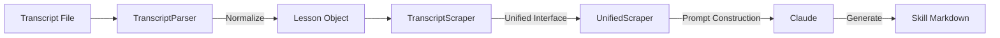

# Design: Transcript Capability

## Architecture

The transcript processing pipeline will follow the existing `Skill_Seekers` architecture but introduces a normalization layer to handle the variety of transcript formats.



### 1. Normalization Layer (`TranscriptParser`)
Files like `.srt` or `.vtt` contain timestamps and formatting that distract from the core content during skill extraction. The parser will:
- **Strip Timestamps:** Remove time codes from subtitle formats.
- **Merge Lines:** Combine fragmented lines into coherent paragraphs.
- **Segment:** If possible, use timestamp gaps or markers to identify logical sections (Optional V2).
- **Metadata:** Extract title from filename.

**Output:** A simple `Lesson` dataclass or dict:
```python
@dataclass
class Lesson:
    title: str
    content: str  # The full, clean text
    source_path: str
```

### 2. Scraper Implementation (`TranscriptScraper`)
This class adapts the `Lesson` object to the `BaseScraper` interface expected by the system.
- **`fetch()`**: Calls the parser to get content.
- **`clean()`**: (No-op or minimal cleanup since parser did logical normalization).
- **`chunk()`**: Splits extremely long transcripts if they exceed context windows (though 200k context usually suffices for single lectures).

### 3. Prompt Engineering
The core value add (Summaries, Exercises) happens at the prompting stage. We will inject a specific instruction block when the source type is `transcript`:
> "You are processing a course transcript. Your output must explicitly include: 1. A summary of the lesson. 2. A list of key concepts. 3. Three distinct practice exercises to reinforce the material."

## Trade-offs
- **Loss of Timing:** We discard timestamps, meaning the generated skill won't link back to specific video moments. *Decision: Acceptable for V1. Skills are for reading/recall, not video navigation.*
- **Context Limit:** Very long courses (e.g., 5-hour concatenated subtitles) might break. *Decision: Require users to split files by lesson/video for now.*
