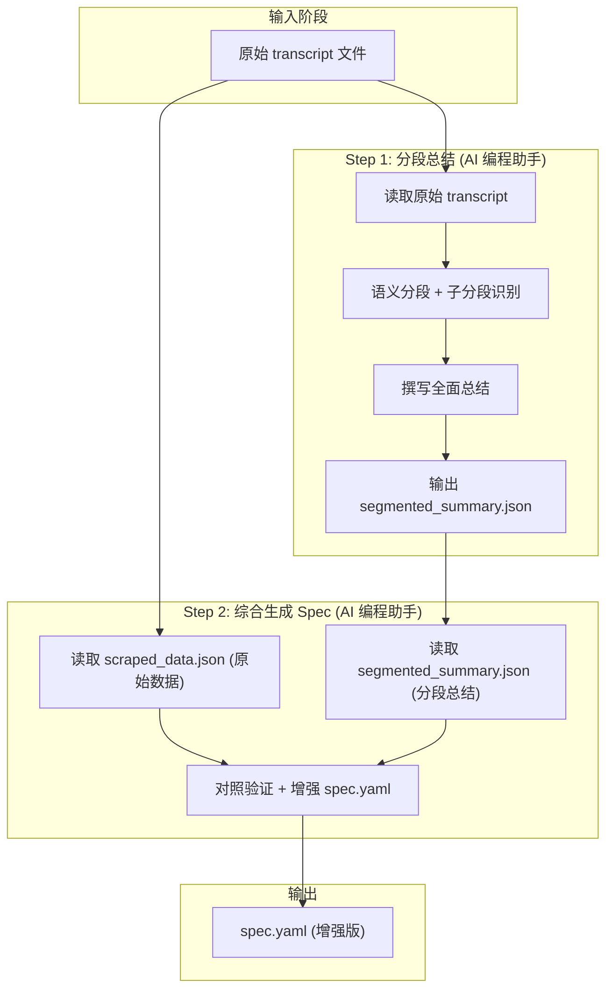

# Design: Transcript Semantic Segmentation

## 完整工作流程



## 数据模型

### segmented_summary.json 结构

```json
{
  "version": "1.0",
  "source_file": "16.第八章_原文.txt",
  "total_segments": 3,
  "segments": [
    {
      "id": "1",
      "timestamp": "00:52 - 08:05",
      "marker": "好",
      "reason": "讲者使用'好'作为新话题开始标志",
      "summary_full": "详细完整的总结...",
      "summary_brief": "简短摘要",
      "key_points": ["要点1", "要点2"],
      "examples_simplified": ["简化例子"],
      "homophone_notes": ["同音字修正"],
      "subsegments": [
        {"id": "1.1", "topic": "子话题", "summary": "子分段总结"}
      ]
    }
  ],
  "metadata": {
    "generated_by": "AI_assistant",
    "generated_at": "ISO 8601"
  }
}
```

## 工作流步骤详情

### Step 1: 分段总结

**执行者**: AI 编程助手

**prompt 要点**:
- 根据标志词分段：'好'、'下一个'、'第一个'、'首先'、'其次'、'最后'
- 不按篇幅分段，只在明确标志处分段
- 每段提供 summary_full（让未读原文者能完全理解）
- 保留并简化例子
- 同音字修正

**输出**: `segmented_summary.json`（独立文件）

### Step 2: 综合生成 Spec

**输入**:
- `scraped_data.json`（原始数据，用于验证准确性）
- `segmented_summary.json`（分段总结）

**处理**:
- 对照原文验证总结准确性
- 将分段结构融入 spec.yaml
- 使用分段总结增强 lessons 结构

**输出**: 增强版 `spec.yaml`

## 边界情况

| 情况 | 处理方式 |
|------|----------|
| 无标志词 | 按段落分段，reason 注明 |
| 超长分段 | 创建子分段 |
| 无时间戳 | timestamp = "N/A" |
| 同音字歧义 | 记录所有候选，标注最可能的 |
