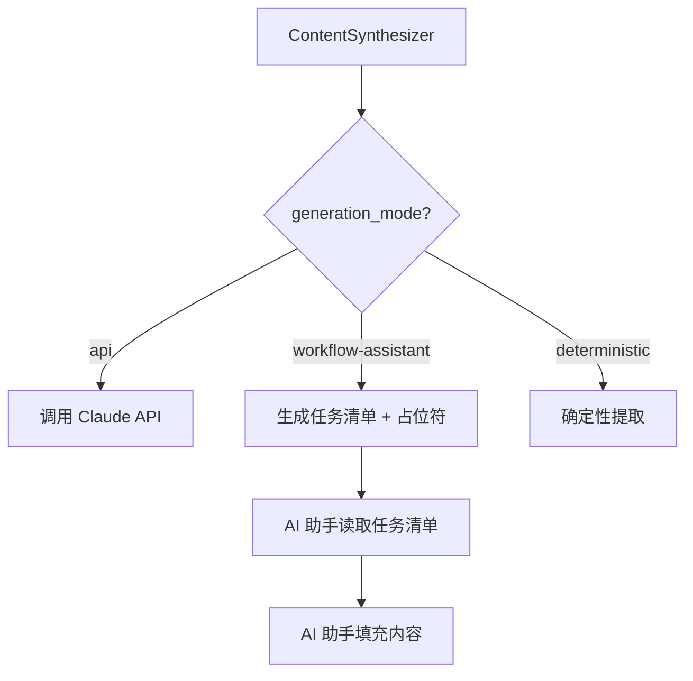

# refactor-apply-workflow-local-ai

## 概述

为 ContentSynthesizer 新增 `workflow-assistant` 生成模式，让工作流中的 AI 编程助手（如 Antigravity、Claude Code、Codex）可以替代外部 Claude API 完成内容生成。

## 动机

### 当前问题
- ContentSynthesizer 只有两种模式：外部 Claude API 或确定性回退
- 外部 API 需要 `ANTHROPIC_API_KEY`，增加配置复杂度
- 确定性回退生成的内容质量较低（大量占位符）
- 用户必须在"高质量但需 API Key"和"无 API 但低质量"之间选择

### 期望效果
- 新增 `workflow-assistant` 模式，由执行工作流的 AI 助手生成内容
- 无需外部 API Key，利用本地 AI 编程助手的能力
- 提供与 `/skill-seekers-proposal` 一致的工作模式

## 设计

### 生成模式

| 模式 | 描述 | API Key 需求 |
|------|------|--------------|
| `api` | 调用外部 Claude API | 是 |
| `workflow-assistant` | 输出任务清单供 AI 助手执行 | 否 |
| `deterministic` | 确定性提取（现有 no-llm 行为） | 否 |

### 架构变更



### 任务清单格式 (tasks.json)

```json
{
  "version": "1.0",
  "tasks": [
    {
      "id": "section-001",
      "type": "section",
      "title": "课程摘要",
      "purpose": "提供课程核心内容概述",
      "expected_content": ["核心概念", "学习目标"],
      "target_path": "output/SKILL.md#课程摘要",
      "source_excerpt": "原始材料摘录...",
      "instructions": "根据原始材料生成结构化摘要"
    }
  ]
}
```

### CLI 变更

新增 `--generation-mode` 参数：
```bash
skill-seekers apply-spec <spec.yaml> --generation-mode workflow-assistant
```

参数映射：
- `--no-llm` → `--generation-mode deterministic`（向后兼容）
- 默认 → `--generation-mode api`（现有行为）

## 范围

### 代码变更
- **ContentSynthesizer**: 新增 `generation_mode` 参数和任务清单生成
- **CLI main.py**: 新增 `--generation-mode` 参数
- **UnifiedSkillBuilder**: 传递 generation_mode 参数

### 工作流文档变更
- **skill-seekers-apply.md**: 默认使用 workflow-assistant 模式
- **apply.md**: 同步更新

## 交付物

- 代码: `content_synthesizer.py`, `main.py`, `unified_skill_builder.py`
- 工作流: `skill-seekers-apply.md`, `apply.md`
- 测试: `test_content_synthesizer.py`（新增模式测试）
