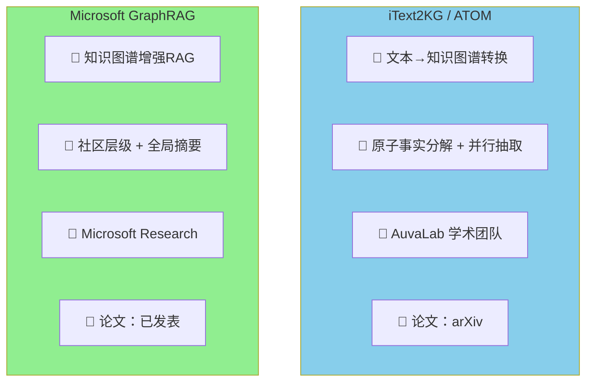
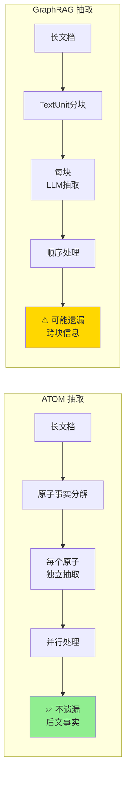
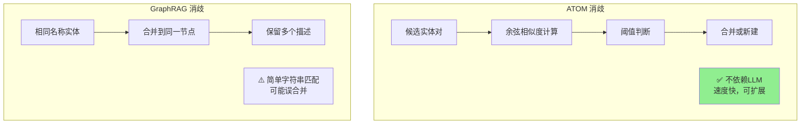
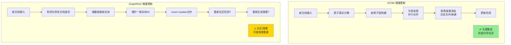
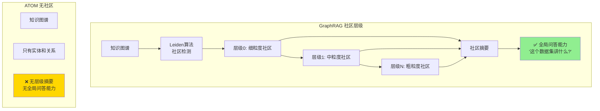
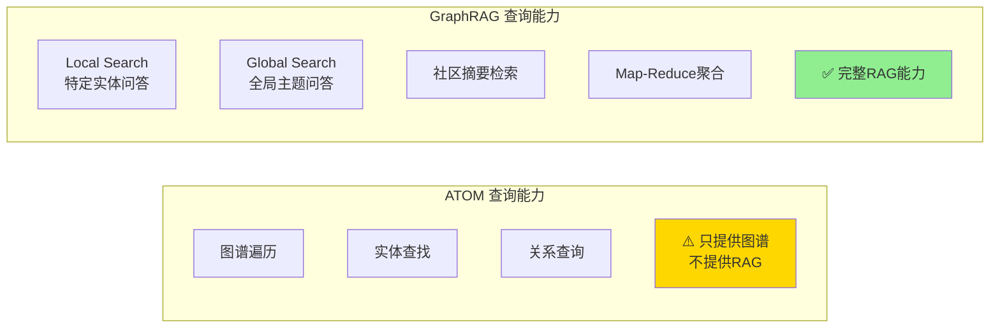
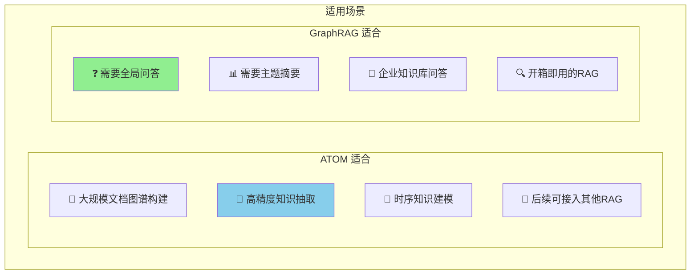
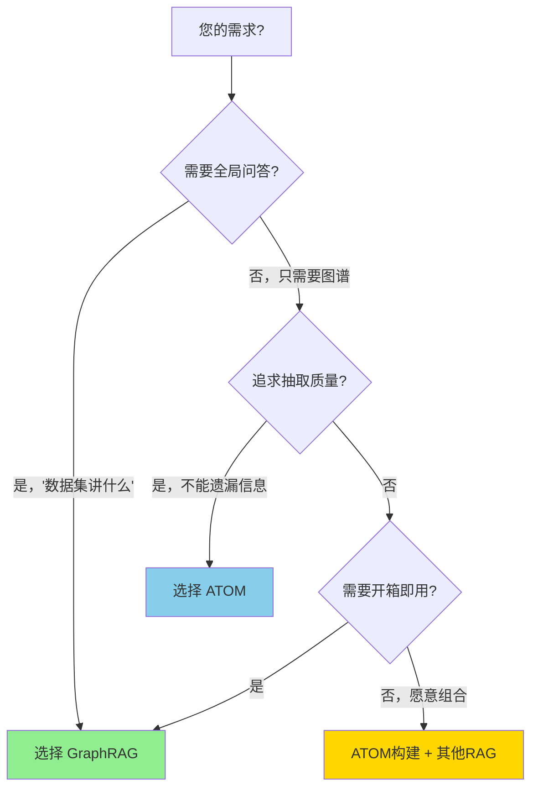
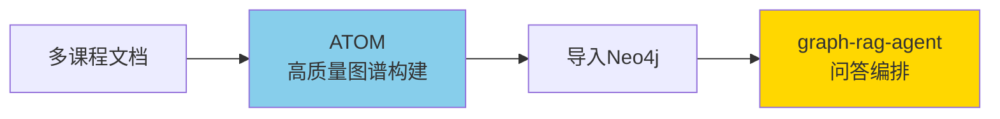

# iText2KG (ATOM) vs Microsoft GraphRAG：知识图谱构建与增量更新对比

## 一、项目定位

| 维度 | iText2KG/ATOM | Microsoft GraphRAG |
|------|---------------|-------------------|
| **开发者** | AuvaLab 学术团队 | Microsoft Research |
| **主要用途** | 高质量知识图谱构建 | 知识图谱增强问答 |
| **核心理念** | 原子事实 + 并行合并 | 社区层级 + 全局摘要 |
| **GitHub Stars** | 1K+ | 20K+ |

---

## 二、图谱构建流程对比

```mermaid
flowchart TB
    subgraph ATOM_Build["ATOM 构建流程"]
        A1["📄 输入文档"] --> A2["原子事实分解<br/>拆成最小事实单元"]
        A2 --> A3["并行5元组抽取<br/>(S,P,O,t_start,t_end)"]
        A3 --> A4["原子图构建<br/>每个事实一个小图"]
        A4 --> A5["并行图合并<br/>距离度量消歧"]
        A5 --> A6["最终知识图谱"]
    end
    
    subgraph GraphRAG_Build["GraphRAG 构建流程"]
        G1["📄 输入文档"] --> G2["TextUnit切分<br/>按token数分块"]
        G2 --> G3["LLM实体关系抽取"]
        G3 --> G4["图谱索引构建"]
        G4 --> G5["Leiden社区检测"]
        G5 --> G6["社区摘要生成"]
        G6 --> G7["层级索引结构"]
    end
    
    style A2 fill:#FFD700
    style A5 fill:#FFD700
    style G5 fill:#90EE90
    style G6 fill:#90EE90
```

---

## 三、核心技术差异

### 3.1 实体抽取方式

| 抽取维度 | ATOM | GraphRAG |
|---------|------|----------|
| **分块方式** | 原子事实分解 | 按 token 数分块 |
| **抽取格式** | 5元组 (S,P,O,t_start,t_end) | 实体 + 关系 + Claim |
| **处理方式** | 大规模并行 | 顺序/小批量 |
| **遗漏风险** | ⭐ 低 (完整性+31%) | ⭐⭐⭐ 中等 |
| **稳定性** | ⭐ 高 (稳定性+17%) | ⭐⭐ 中等 |

### 3.2 实体消歧方式

| 消歧维度 | ATOM | GraphRAG |
|---------|------|----------|
| **方法** | 向量余弦相似度 | 字符串匹配 |
| **LLM依赖** | ❌ 不依赖 | ❌ 不依赖 |
| **准确性** | ⭐⭐⭐⭐⭐ | ⭐⭐⭐ |
| **速度** | 快 (93.8%延迟降低) | 中等 |

---

## 四、增量更新对比

这是两个项目**关键差异点**之一：

### 增量更新详细对比

| 维度 | ATOM | GraphRAG |
|------|------|----------|
| **增量支持** | ✅ 原生支持 | ✅ v0.4.0+ 支持 |
| **新实体处理** | 并行合并到现有图 | 检测差异后增量抽取 |
| **消歧方式** | 向量相似度自动消歧 | 维护一致实体ID |
| **社区更新** | ❌ 无社区概念 | ⚠️ 可能需要重建 |
| **摘要更新** | ❌ 无摘要概念 | ⚠️ 可能需要重新生成 |
| **时序保留** | ✅ t_start/t_end | ⚠️ 无时序建模 |
| **更新开销** | ⭐ 低 (只处理新内容) | ⭐⭐ 中等 (可能触发重建) |

---

## 五、社区检测与层级结构

这是 **GraphRAG 的核心优势**：

| 社区功能 | ATOM | GraphRAG |
|---------|------|----------|
| **社区检测** | ❌ 无 | ✅ Leiden算法 |
| **层级结构** | ❌ 无 | ✅ 多层级 |
| **社区摘要** | ❌ 无 | ✅ 自动生成 |
| **全局问答** | ❌ 不支持 | ✅ 核心功能 |

---

## 六、检索与问答能力

| 问答维度 | ATOM | GraphRAG |
|---------|------|----------|
| **定位** | 图谱构建工具 | 完整RAG系统 |
| **Local Search** | ❌ 需自行实现 | ✅ 内置 |
| **Global Search** | ❌ 无 | ✅ 核心功能 |
| **问答生成** | ❌ 无 | ✅ LLM集成 |

---

## 七、性能对比

基于 ATOM 论文数据：

| 指标 | ATOM vs GraphRAG |
|------|------------------|
| **事实完整性** | ATOM +31% |
| **时序完整性** | ATOM +18% |
| **结果稳定性** | ATOM +17% |
| **合并延迟** | ATOM 快 93.8% |

但 GraphRAG 在**问答能力**上更完整。

---

## 八、适用场景对比

---

## 九、总结对比表

| 维度 | iText2KG/ATOM | Microsoft GraphRAG | 优势方 |
|------|---------------|-------------------|--------|
| **抽取完整性** | ⭐⭐⭐⭐⭐ | ⭐⭐⭐ | ATOM |
| **抽取稳定性** | ⭐⭐⭐⭐⭐ | ⭐⭐⭐ | ATOM |
| **处理速度** | ⭐⭐⭐⭐⭐ | ⭐⭐⭐ | ATOM |
| **时序建模** | ⭐⭐⭐⭐ | ⭐⭐ | ATOM |
| **社区检测** | ⭐ | ⭐⭐⭐⭐⭐ | GraphRAG |
| **全局问答** | ⭐ | ⭐⭐⭐⭐⭐ | GraphRAG |
| **增量更新** | ⭐⭐⭐⭐⭐ | ⭐⭐⭐ | ATOM |
| **开箱即用** | ⭐⭐ | ⭐⭐⭐⭐⭐ | GraphRAG |
| **生态成熟度** | ⭐⭐⭐ | ⭐⭐⭐⭐⭐ | GraphRAG |

---

## 十、选择建议

### 最佳组合方案

对于**教育内容整合**项目：

- 用 **ATOM** 做高质量知识抽取（不遗漏知识点）
- 用 **graph-rag-agent** 做问答编排（多Agent、可视化）
- 或用 **GraphRAG** 的社区检测给图谱加上层级结构
