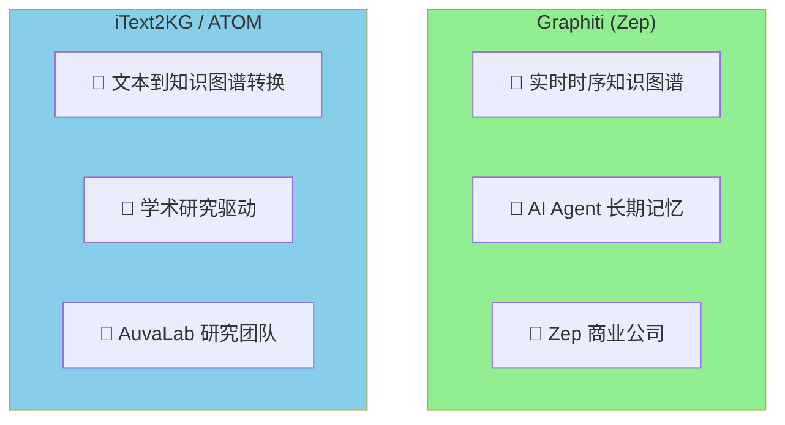
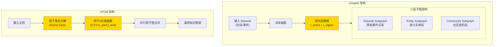
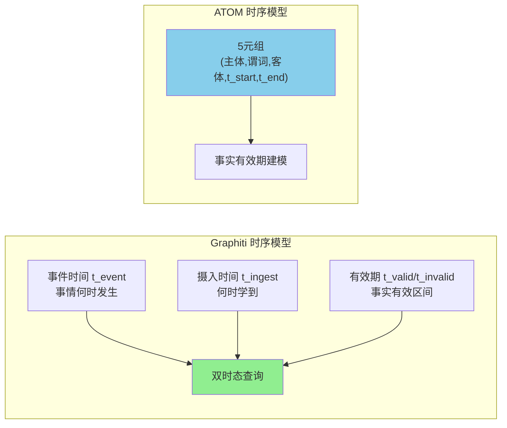
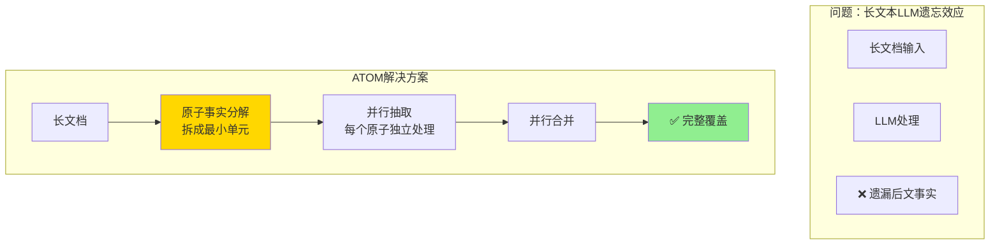
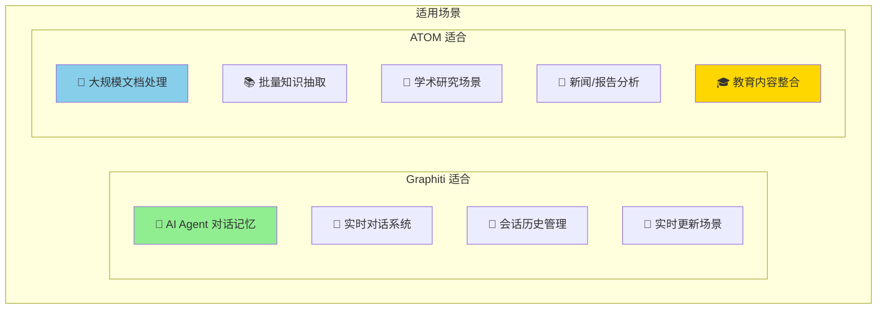
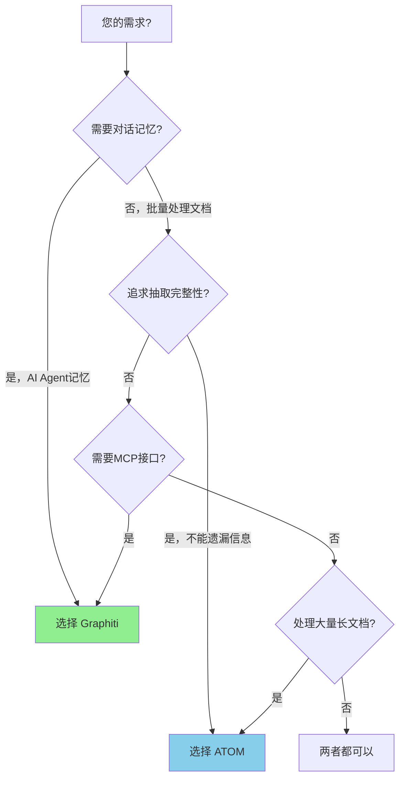

# Graphiti vs iText2KG(ATOM)：知识图谱构建方案对比

## 一、项目定位



| 维度 | Graphiti | iText2KG/ATOM |
|------|----------|---------------|
| **开发者** | Zep 商业公司 | AuvaLab 学术团队 |
| **主要用途** | AI Agent 记忆系统 | 从文本构建知识图谱 |
| **核心理念** | 时序情景记忆 | 原子事实分解 + 并行抽取 |
| **数据库** | Neo4j | Neo4j / 任意图数据库 |
| **论文** | ✅ 有学术论文 | ✅ 有学术论文 (arXiv) |

---

## 二、技术架构对比



---

## 三、核心功能对比

### 3.1 功能矩阵

| 功能 | Graphiti | iText2KG/ATOM | 说明 |
|------|----------|---------------|------|
| **实体抽取** | ✅ LLM驱动 | ✅ LLM驱动 | 持平 |
| **关系抽取** | ✅ | ✅ 5元组格式 | ATOM更结构化 |
| **实体消歧** | ✅ 语义匹配 | ✅ 余弦相似度 | 持平 |
| **时序建模** | ✅ 双时态 | ✅ t_start/t_end | 都支持 |
| **原子事实分解** | ❌ | ✅ 核心特性 | **ATOM优势** |
| **并行处理** | ⚠️ 异步 | ✅ 大规模并行 | ATOM性能更好 |
| **增量更新** | ✅ 实时 | ✅ 支持 | 持平 |
| **MCP接口** | ✅ 内置 | ❌ | **Graphiti优势** |
| **情景记忆** | ✅ Episode概念 | ❌ | **Graphiti优势** |

### 3.2 时序建模差异



| 时序能力 | Graphiti | ATOM |
|---------|----------|------|
| 事件发生时间 | ✅ t_event | ⚠️ 隐式 |
| 系统学习时间 | ✅ t_ingest | ❌ |
| 事实有效期 | ✅ t_valid/t_invalid | ✅ t_start/t_end |
| 双时态查询 | ✅ | ❌ |

---

## 四、抽取质量对比

这是**ATOM的核心优势**：



### ATOM 性能优势（来自论文）

| 指标 | ATOM vs Graphiti |
|------|-----------------|
| 事实完整性 | +31% |
| 时序完整性 | +18% |
| 结果稳定性 | +17% |
| 合并延迟 | -93.8% |

---

## 五、适用场景对比



---

## 六、集成难度对比

| 维度 | Graphiti | iText2KG/ATOM |
|------|----------|---------------|
| **安装方式** | pip install | pip install |
| **LangChain兼容** | ✅ | ✅ 完整支持 |
| **文档质量** | ✅ 商业级 | ✅ 学术论文+示例 |
| **社区活跃** | ✅ 活跃 | ✅ 活跃 |
| **学习曲线** | 中等 | 简单 |

---

## 七、代码使用对比

### Graphiti 使用方式

```python
from graphiti_core import Graphiti

# 初始化
graphiti = Graphiti(neo4j_uri, neo4j_user, neo4j_password)

# 添加情景
await graphiti.add_episode(
    name="对话1",
    content="用户说：今天天气真好",
    reference_time=datetime.now()
)

# 查询
results = await graphiti.search("天气相关的对话")
```

### iText2KG/ATOM 使用方式

```python
from itext2kg import ATOM

# 初始化
atom = ATOM(llm=your_llm, embeddings=your_embeddings)

# 构建图谱
kg = atom.build_graph(documents)

# 可视化
kg.visualize()
```

---

## 八、总结对比

| 维度 | Graphiti | iText2KG/ATOM | 优势方 |
|------|----------|---------------|--------|
| **实时对话记忆** | ⭐⭐⭐⭐⭐ | ⭐⭐ | Graphiti |
| **大规模文档处理** | ⭐⭐⭐ | ⭐⭐⭐⭐⭐ | ATOM |
| **抽取完整性** | ⭐⭐⭐ | ⭐⭐⭐⭐⭐ | ATOM |
| **处理速度** | ⭐⭐⭐ | ⭐⭐⭐⭐⭐ | ATOM |
| **MCP集成** | ⭐⭐⭐⭐⭐ | ⭐ | Graphiti |
| **情景记忆** | ⭐⭐⭐⭐⭐ | ⭐⭐ | Graphiti |
| **商业支持** | ⭐⭐⭐⭐⭐ | ⭐⭐ | Graphiti |

---

## 九、选择建议



### 选择 Graphiti 如果：
- ✅ 构建 AI Agent 的长期记忆
- ✅ 需要 MCP 协议集成
- ✅ 实时对话场景
- ✅ 需要商业支持

### 选择 iText2KG/ATOM 如果：
- ✅ 大规模文档批量处理
- ✅ 追求抽取完整性和稳定性
- ✅ 学术研究或教育场景
- ✅ 需要处理长文档不遗漏

---

## 十、与您目标的关系

对于**教育内容整合**项目：

| 需求 | Graphiti | ATOM | 推荐 |
|------|----------|------|------|
| 多课程文档处理 | ⚠️ | ✅ | ATOM |
| 不遗漏知识点 | ⚠️ | ✅ | ATOM |
| 多老师内容去重 | ✅ | ✅ | 都行 |
| 与AI Agent集成 | ✅ | ⚠️ | Graphiti |

**最佳方案**：用 ATOM 做知识抽取，用 Graphiti 或 graph-rag-agent 做问答。
