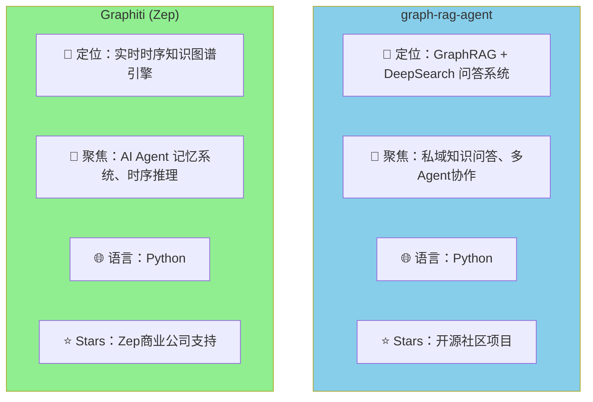
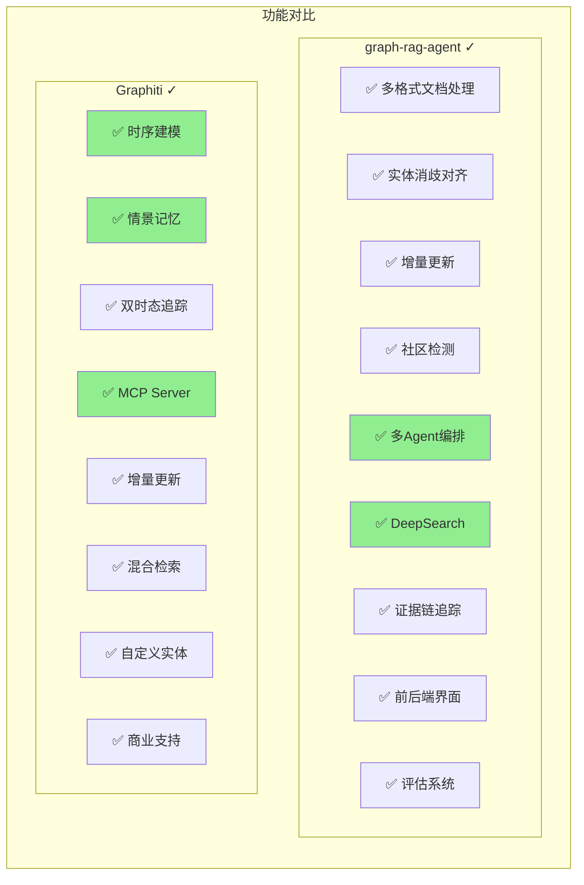
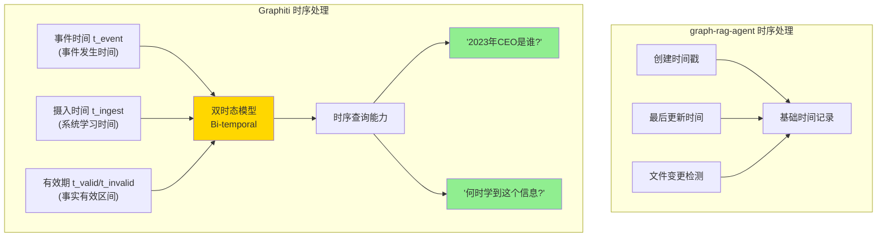
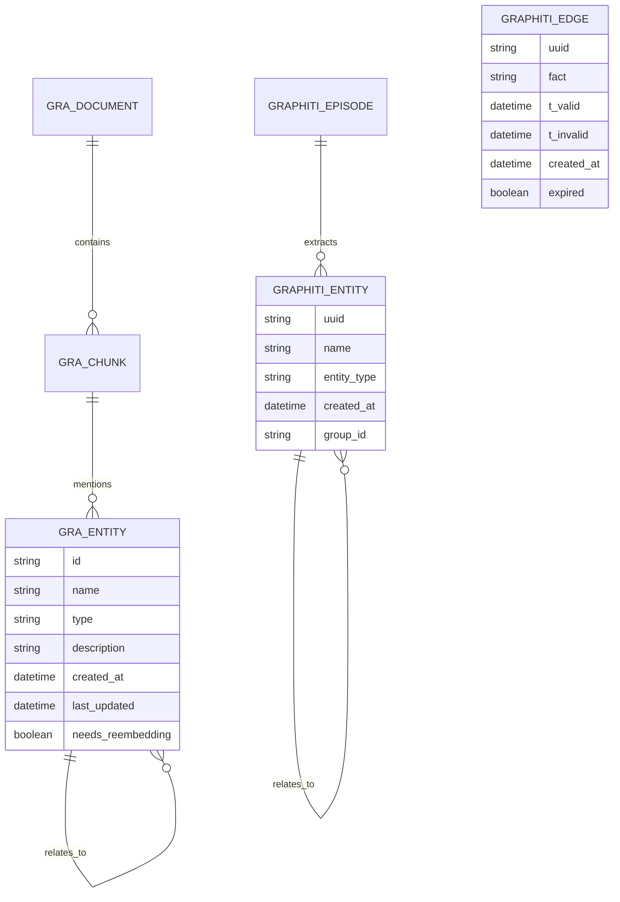
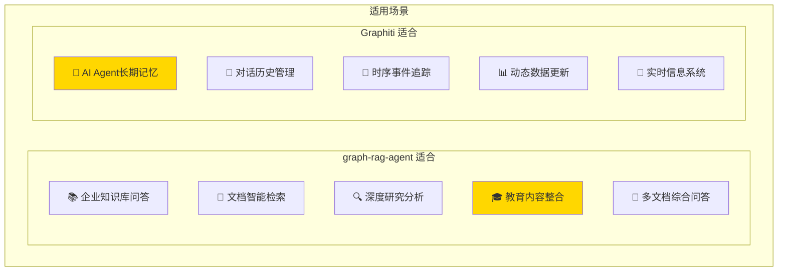
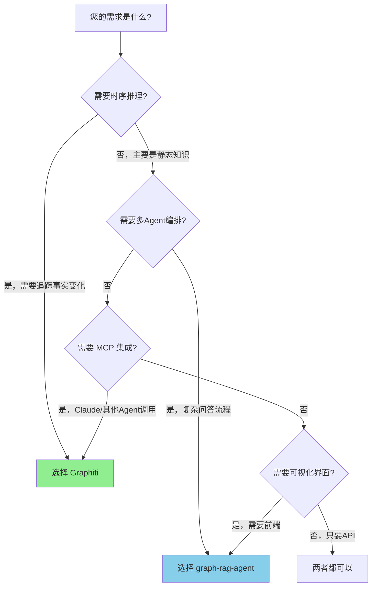
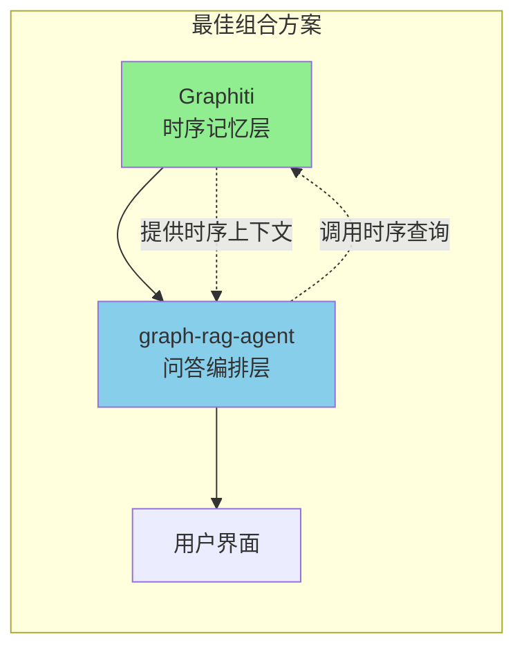

# graph-rag-agent vs Graphiti：全方位对比分析

## 一、项目概览



| 维度 | graph-rag-agent | Graphiti |
|------|-----------------|----------|
| **开发者** | 个人/社区开源 | Zep 公司 (商业支持) |
| **主要用途** | 私域知识问答系统 | AI Agent 长期记忆 |
| **核心理念** | GraphRAG + DeepSearch | 时序知识图谱 + 情景记忆 |
| **数据库** | Neo4j | Neo4j |
| **MCP 支持** | ❌ 无 | ✅ 内置 MCP Server |

---

## 二、架构对比

```mermaid
flowchart TB
    subgraph GRA_Arch["graph-rag-agent 架构"]
        A1["文档处理<br/>PDF/MD/DOCX"] --> A2["实体抽取<br/>LLM驱动"]
        A2 --> A3["实体消歧<br/>向量+字符串"]
        A3 --> A4["图谱构建<br/>Neo4j"]
        A4 --> A5["多级检索<br/>Local/Global/Hybrid"]
        A5 --> A6["多Agent协作<br/>Plan-Execute-Report"]
        A6 --> A7["问答生成"]
    end
    
    subgraph Graphiti_Arch["Graphiti 架构"]
        B1["情景输入<br/>Episode"] --> B2["实体抽取<br/>LLM驱动"]
        B2 --> B3["双时态建模<br/>事件时间+摄入时间"]
        B3 --> B4["三层子图<br/>Episode/Entity/Community"]
        B4 --> B5["混合检索<br/>语义+关键词+遍历"]
        B5 --> B6["时序推理"]
    end
    
    style A6 fill:#FFD700
    style B3 fill:#FFD700
```



---

## 三、核心功能对比

### 3.1 功能矩阵



### 3.2 详细功能表

| 功能类别 | graph-rag-agent | Graphiti | 优势方 |
|---------|-----------------|----------|--------|
| **文档处理** | ✅ PDF/MD/DOCX/CSV/JSON/YAML | ⚠️ 主要是文本/JSON | graph-rag-agent |
| **实体抽取** | ✅ LLM驱动 | ✅ LLM驱动 | 持平 |
| **实体消歧** | ✅ 字符串+向量+NIL检测 | ✅ 语义匹配 | graph-rag-agent |
| **时序建模** | ❌ 无 | ✅ 双时态模型 | **Graphiti** |
| **情景记忆** | ❌ 无 | ✅ Episode概念 | **Graphiti** |
| **增量更新** | ✅ 文件变更监控 | ✅ 实时增量 | 持平 |
| **社区检测** | ✅ Leiden + SLLPA | ✅ Community Subgraph | 持平 |
| **检索方式** | ✅ Local/Global/Hybrid/Deep | ✅ 语义+BM25+遍历 | graph-rag-agent |
| **Agent编排** | ✅ Plan-Execute-Report | ❌ 仅提供图谱API | **graph-rag-agent** |
| **MCP接口** | ❌ 无 | ✅ 内置 MCP Server | **Graphiti** |
| **前端界面** | ✅ 完整Web界面 | ❌ 仅后端API | graph-rag-agent |
| **评估系统** | ✅ 20+评估指标 | ❌ 无 | graph-rag-agent |
| **商业支持** | ❌ 社区维护 | ✅ Zep公司支持 | Graphiti |

---

## 四、时序处理能力对比

这是两个项目**最大的差异点**：



| 时序能力 | graph-rag-agent | Graphiti |
|---------|-----------------|----------|
| 记录创建时间 | ✅ | ✅ |
| 记录更新时间 | ✅ | ✅ |
| 事件发生时间 | ❌ | ✅ |
| 事实有效期 | ❌ | ✅ |
| 时间点查询 | ❌ | ✅ "2020年X是什么?" |
| 事实演变追踪 | ❌ | ✅ "X如何变化?" |

---

## 五、数据模型对比



---

## 六、适用场景对比



---

## 七、性能与可扩展性

| 指标 | graph-rag-agent | Graphiti |
|------|-----------------|----------|
| **批量处理** | ✅ 支持大规模文档 | ⚠️ 偏向实时增量 |
| **并行处理** | ✅ MAX_WORKERS配置 | ✅ 异步处理 |
| **缓存机制** | ✅ 多级缓存 | ⚠️ 基础缓存 |
| **延迟** | 中等 (批量优化) | 低 (实时优化) |
| **可扩展性** | ✅ 模块化设计 | ✅ 模块化设计 |

---

## 八、总结对比图

```mermaid
radar
    title 能力雷达图
    x_axis_label 功能维度
    
    "graph-rag-agent" : [8, 9, 7, 3, 8, 9, 8, 2]
    "Graphiti" : [5, 7, 8, 10, 6, 6, 4, 9]
    
    labels: ["文档处理", "检索能力", "增量更新", "时序建模", "实体消歧", "Agent编排", "可视化", "MCP集成"]
```

> 注：由于 Mermaid 不支持雷达图，以下是文字版对比：

| 维度 | graph-rag-agent | Graphiti | 说明 |
|------|-----------------|----------|------|
| 文档处理 | ⭐⭐⭐⭐⭐ | ⭐⭐⭐ | GRA 支持更多格式 |
| 检索能力 | ⭐⭐⭐⭐⭐ | ⭐⭐⭐⭐ | GRA 多级检索更丰富 |
| 增量更新 | ⭐⭐⭐⭐ | ⭐⭐⭐⭐⭐ | Graphiti 实时性更强 |
| 时序建模 | ⭐⭐ | ⭐⭐⭐⭐⭐ | Graphiti 核心优势 |
| 实体消歧 | ⭐⭐⭐⭐⭐ | ⭐⭐⭐⭐ | GRA 方法更全面 |
| Agent编排 | ⭐⭐⭐⭐⭐ | ⭐⭐ | GRA 核心优势 |
| 可视化 | ⭐⭐⭐⭐⭐ | ⭐⭐ | GRA 有完整界面 |
| MCP集成 | ⭐ | ⭐⭐⭐⭐⭐ | Graphiti 内置 MCP |

---

## 九、选择建议



### 选择 graph-rag-agent 如果：
- ✅ 需要处理多种格式文档
- ✅ 需要多Agent协作问答
- ✅ 需要可视化的Web界面
- ✅ 需要深度研究和证据追踪
- ✅ 做教育内容整合项目

### 选择 Graphiti 如果：
- ✅ 需要时序推理（"过去X是什么"）
- ✅ 需要 AI Agent 长期记忆
- ✅ 需要 MCP 协议集成
- ✅ 数据频繁变化，需实时更新
- ✅ 需要商业支持和维护

---

## 十、组合使用建议

**两个项目可以互补**：



- 用 **Graphiti** 管理时序知识和 Agent 记忆
- 用 **graph-rag-agent** 做复杂问答编排和用户界面
