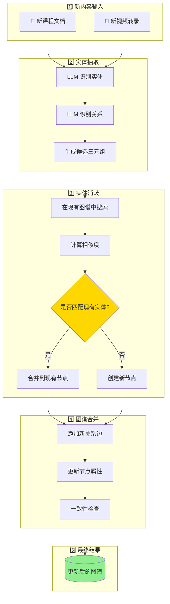
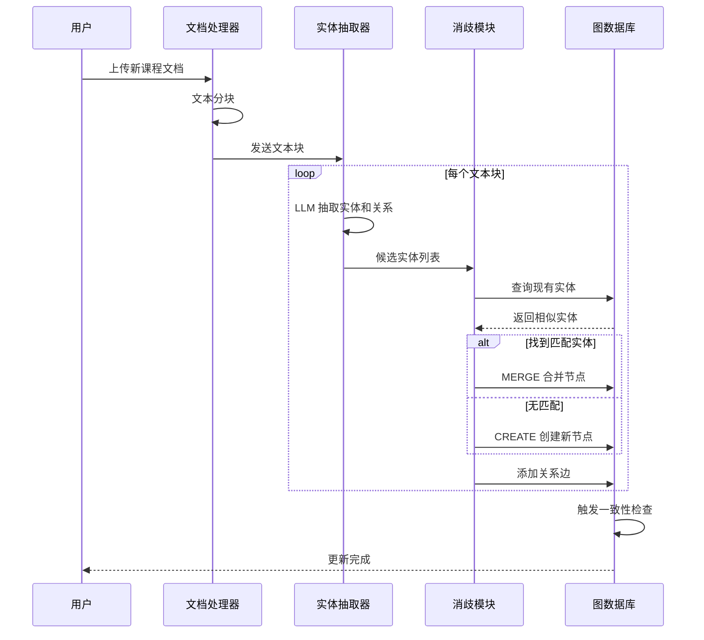
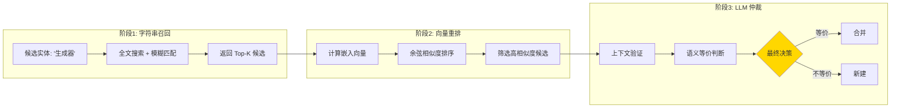
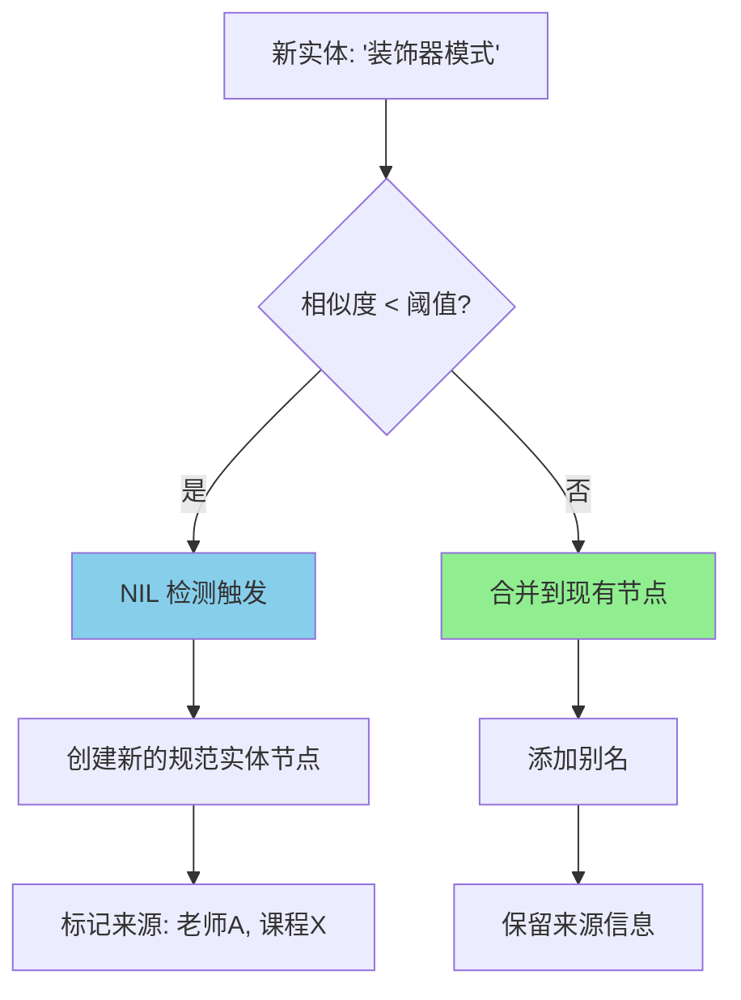
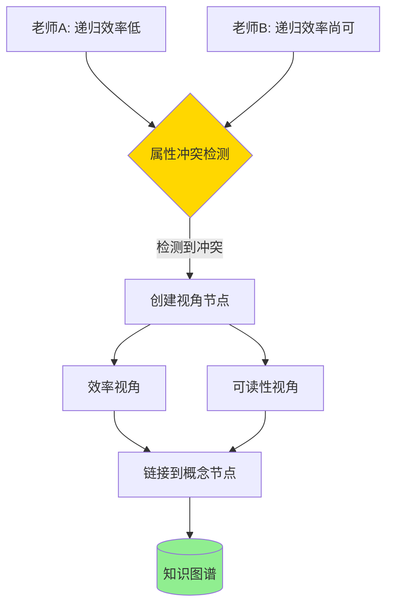
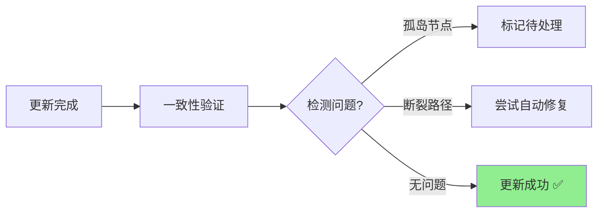
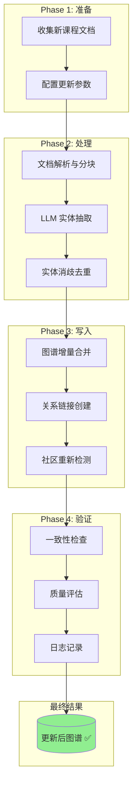

# GraphRAG 增量更新流程详解

本文档解释如何将新的教育内容增量更新到现有的 GraphRAG 知识图谱中。

---

## 一、增量更新的核心流程



---

## 二、graph-rag-agent 中的增量更新实现

根据 `graph-rag-agent` 项目结构，增量更新位于:

```
graphrag_agent/
└── integrations/
    └── build/
        ├── incremental/           # 增量更新子模块
        └── incremental_update.py  # 增量更新管理
```

### 2.1 增量更新的关键步骤



---

## 三、实体消歧详解（核心去重机制）

这是实现"严格整合"的关键步骤。

### 3.1 三阶段消歧流程



### 3.2 NIL 检测

当新实体与现有图谱中任何实体都不匹配时：



---

## 四、冲突处理机制

当多位老师的内容存在矛盾时：

### 4.1 冲突检测



### 4.2 多视角保留策略

```
(:LearningResource {source: "老师A"})
    -[:TEACHES]->
(:CanonicalConcept {name: "递归"})
    <-[:TEACHES]-
(:LearningResource {source: "老师B"})
```

不同老师的讲解作为独立的 `LearningResource` 节点，都指向同一个 `CanonicalConcept`。

---

## 五、使用 graph-rag-agent 进行增量更新

### 5.1 基本命令

```bash
# 进入项目目录
cd graph-rag-agent

# 执行增量更新
python -m graphrag_agent.integrations.build.incremental_update \
    --input_dir ./new_courses/ \
    --mode incremental
```

### 5.2 增量更新配置

在 `.env` 文件中配置：

```env
# Neo4j 连接
NEO4J_URI=bolt://localhost:7687
NEO4J_USERNAME=neo4j
NEO4J_PASSWORD=your_password

# 增量更新参数
INCREMENTAL_MODE=true
ENTITY_RESOLUTION_THRESHOLD=0.85
```

### 5.3 程序化调用

```python
from graphrag_agent.integrations.build import incremental_update

# 执行增量更新
result = incremental_update.run(
    input_files=["new_course.pdf"],
    mode="incremental",
    entity_resolution_threshold=0.85
)

print(f"新增实体: {result.new_entities}")
print(f"合并实体: {result.merged_entities}")
print(f"新增关系: {result.new_relations}")
```

---

## 六、更新后的验证

### 6.1 一致性检查



### 6.2 验证查询示例

```cypher
// 检查新增的课程内容
MATCH (r:LearningResource)
WHERE r.created_at > datetime() - duration('P1D')
RETURN r.title, r.source, r.instructor

// 检查实体合并情况
MATCH (c:CanonicalConcept)
WHERE size(c.aliases) > 1
RETURN c.name, c.aliases
```

---

## 七、完整更新流程图



---

## 总结

| 步骤 | 说明 | 关键技术 |
|------|------|----------|
| 1️⃣ 文档处理 | 解析新课程文档 | text_chunker |
| 2️⃣ 实体抽取 | LLM 识别实体和关系 | extraction 模块 |
| 3️⃣ 实体消歧 | 字符串召回 + 向量重排 + NIL检测 | processing 模块 |
| 4️⃣ 图谱合并 | MERGE 操作，保留来源 | Neo4j Cypher |
| 5️⃣ 验证检查 | 一致性校验，质量评估 | evaluation 模块 |

> 💡 关键点：整个流程中最重要的是**实体消歧**步骤，它决定了能否实现"去重但保留多老师视角"的目标。
