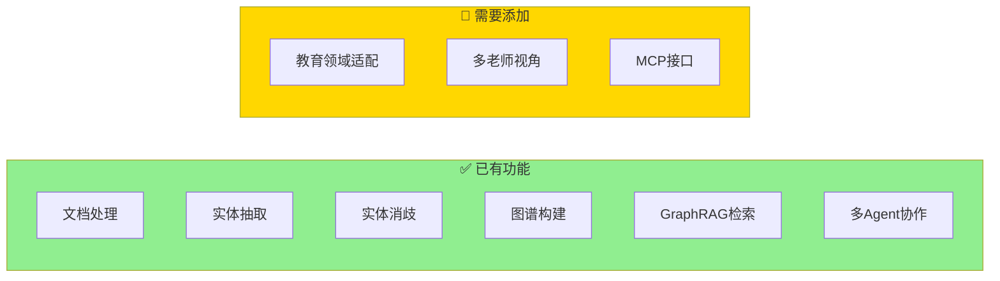
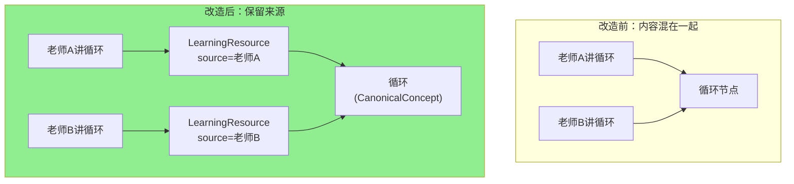
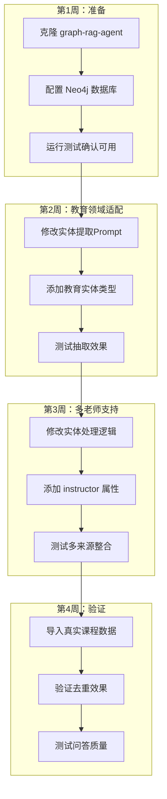

# 基于 graph-rag-agent 实现教育内容整合：实施指南

## 您已经有什么？

**graph-rag-agent 项目已经提供了 90% 的功能**，您不需要从零开始！



---

## 只需要做 3 件事

### 第 1 步：定义教育领域的实体类型

**目标**：告诉系统什么是"课程"、"老师"、"知识点"

**在哪里改**：修改实体提取的 Prompt

```
graphrag_agent/
└── config/
    └── prompts/          ← 在这里添加教育领域的提示词
```

**具体要做的**：

```python
# 在实体抽取提示词中添加教育领域的实体类型

EDUCATION_ENTITY_TYPES = """
请识别以下教育领域实体：
- 知识点 (Concept): 如"递归"、"循环"、"变量"
- 课程 (Course): 如"Python基础"、"数据结构"  
- 讲师 (Instructor): 讲授内容的老师
- 教学资源 (LearningResource): 具体的讲解片段
"""
```

---

### 第 2 步：添加多老师视角支持

**目标**：区分不同老师对同一知识点的讲解

**原理图**：



**在哪里改**：修改图谱构建逻辑

```
graphrag_agent/
└── graph/
    └── processing/       ← 在这里修改实体处理逻辑
```

**具体要做的**：

```python
# 在创建节点时添加 instructor 属性

def create_learning_resource(content, instructor, course):
    return {
        "type": "LearningResource",
        "content": content,
        "instructor": instructor,    # 添加讲师来源
        "course": course,
        "created_at": datetime.now()
    }
```

---

### 第 3 步：添加 MCP 接口（可选）

**目标**：让 Claude 能直接调用您的知识图谱

**在哪里加**：创建新的 MCP Server

```
graphrag_agent/
└── mcp/                  ← 新建这个目录
    └── server.py         ← MCP Server 实现
```

**可以参考的项目**：Skill_Seekers 的 MCP 实现

---

## 完整实施流程



---

## 快速开始命令

```bash
# 1. 克隆项目
git clone https://github.com/1517005260/graph-rag-agent.git
cd graph-rag-agent

# 2. 安装依赖
pip install -r requirements.txt

# 3. 配置环境变量
cp .env.example .env
# 编辑 .env 填入 Neo4j 和 LLM API 配置

# 4. 启动 Neo4j（如果使用 Docker）
docker run -d --name neo4j -p 7474:7474 -p 7687:7687 neo4j

# 5. 构建图谱（导入您的课程文档）
python -m graphrag_agent.integrations.build.main --input ./your_courses/

# 6. 启动服务
python -m server.main
```

---

## 总结

| 您要做的事 | 改哪里 | 难度 |
|-----------|--------|------|
| 定义教育实体类型 | `config/prompts/` | ⭐ 简单 |
| 添加多老师视角 | `graph/processing/` | ⭐⭐ 中等 |
| 添加 MCP 接口 | 新建 `mcp/` 目录 | ⭐⭐⭐ 较难（可选）|

**核心思路**：不是从零开发，而是在 graph-rag-agent 基础上做小改动！
