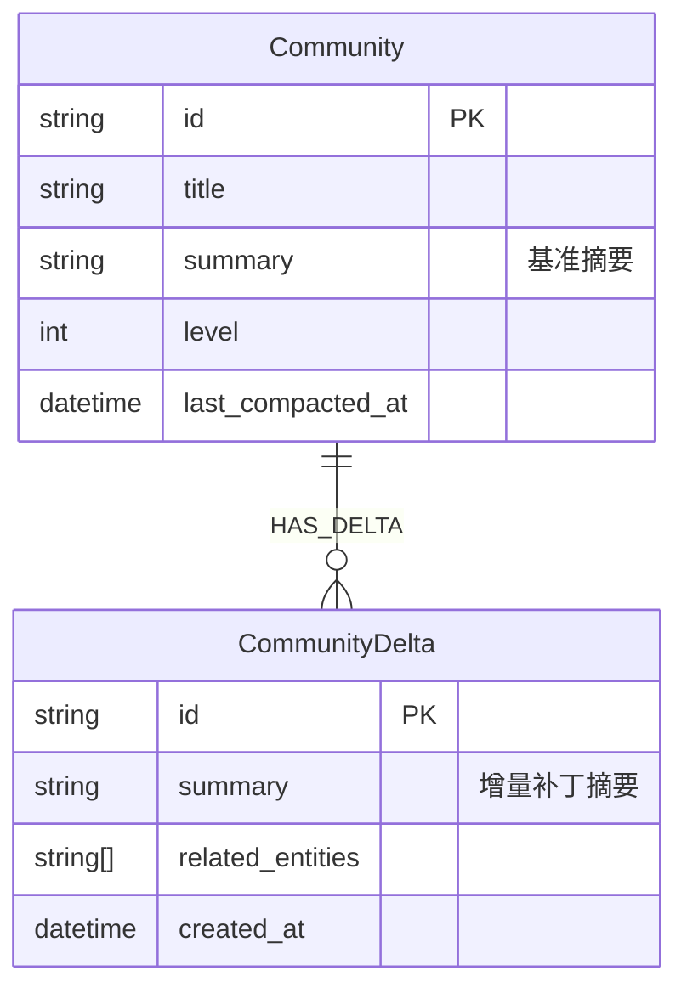

# 架构决策：增量摘要累积策略 (Delta-Summary Accumulation)

## 背景

当前 Knowledge Graph 的社区摘要（Community Summary）生成是一个高成本操作。在 Microsoft GraphRAG 和 graph-rag-agent 的默认实现中，一旦有新数据进入社区，往往需要重新生成整个社区的摘要。这导致增量更新的成本与图谱大小相关，而非与增量数据大小相关，效率较低。

## 目标

实现一种**低成本、高效率**的增量社区摘要更新机制，满足：
1. **写入快**：增量更新时只处理新增数据。
2. **读取准**：查询时能包含最新的增量信息。
3. **最终一致**：通过后台合并机制保持摘要的整洁。

## 方案：Delta-Summary Accumulation (DSA)

参考 LSM-Tree (Log-Structured Merge-tree) 思想，将社区摘要分为"基准摘要"（Base Summary）和"增量补丁"（Delta Summaries）。

### 1. 数据模型设计

在 Neo4j 中扩展数据结构：



### 2. 核心流程

#### 2.1 写入流程 (Write Path) - 极速模式

当增量更新发生时（例如新增几篇文档）：

1. **检测归属**：识别新增实体属于哪些现有社区。
2. **生成 Delta**：
   - 仅提取**新增**的实体和关系。
   - 调用 LLM 生成一段简短的"增量说明"（例如："新增了关于 Python 3.12 模式匹配特性的详细说明"）。
   - **不**读取社区原有的全部内容，极大减少 Context Window 消耗。
3. **存储 Delta**：将生成的简短摘要作为 `__CommunityDelta__` 节点挂载到对应社区下。

#### 2.2 读取流程 (Read Path) - 读时合并

当执行 Global Search 或查询社区详情时：

1. **并发读取**：同时读取 `Community.summary` (基准) 和所有关联的 `CommunityDelta.summary` (增量)。
2. **动态拼接**：
   ```python
   full_summary = base_summary + "\n\n【最新更新】:\n" + "\n".join(delta_summaries)
   ```
3. **上下文注入**：将拼接后的完整内容作为 Context 提供给问答 LLM。

#### 2.3 合并流程 (Compaction) - 异步维护

为了防止 Read Path 拼接过长，设置后台合并策略：

- **触发条件**：Delta 数量 > 5 或 累计 Token > 1000。
- **合并操作**：
  1. 读取基准摘要 + 所有增量摘要。
  2. Prompt LLM: *"请将这些增量更新信息融合进主摘要中，生成一个新的连贯摘要。"*
  3. 更新 `Community.summary`。
  4. 删除已合并的 `CommunityDelta` 节点。

## 伪代码实现

### 写入 (Python)

```python
async def update_community_incremental(community_id, new_entities, llm):
    # 1. 仅针对新增数据生成简报
    delta_text = await llm.generate_delta_summary(new_entities)
    
    # 2. 存入 Neo4j
    query = """
    MATCH (c:__Community__ {id: $cid})
    CREATE (c)-[:HAS_DELTA]->(:__CommunityDelta__ {
        id: randomUUID(),
        summary: $text,
        created_at: datetime()
    })
    """
    await neo4j.run(query, cid=community_id, text=delta_text)
```

### 读取 (Python)

```python
async def get_community_summary_with_deltas(community_id):
    query = """
    MATCH (c:__Community__ {id: $cid})
    OPTIONAL MATCH (c)-[:HAS_DELTA]->(d:__CommunityDelta__)
    WITH c, d ORDER BY d.created_at ASC
    RETURN c.summary as base, collect(d.summary) as deltas
    """
    result = await neo4j.run(query, cid=community_id)
    record = result.single()
    
    # 动态拼接
    base = record['base']
    deltas = record['deltas']
    
    if not deltas:
        return base
        
    return f"{base}\n\n=== 最新增量更新 ===\n" + "\n- ".join(deltas)
```

## 优势分析

| 指标 | 传统全量重写 (Microsoft GraphRAG) | DSA 增量累积 (Proposed) | 提升 |
|------|-------------|-------------|------|
| **更新逻辑** | 社区变更即重写整个摘要 | 只为新增数据生成补丁 | ✅ 更优 |
| **LLM Token 消耗** | 高 (Base + New) | **极低** (Only New) | 📉 降低 80%+ |
| **更新延迟** | 中 (需等待摘要生成) | **低** (秒级完成) | ⚡ 极大提升 |
| **信息准确性** | 高 | 高 (读时拼接) | 持平 |

## 对比 Microsoft GraphRAG 实现

通过 GitHub MCP 检索 `microsoft/graphrag` 仓库代码 (如 `update_community_reports.py`)，发现其增量更新逻辑是：
1. 识别变更文档 (Delta Docs)
2. 识别受影响的社区
3. **重新运行**受影响社区的摘要生成 (Re-summarize)

虽然它避免了全图重跑，但对于"大社区+小更新"的场景，仍然需要重新读取整个大社区的内容来生成新摘要，Token 浪费严重。

**DSA 策略的改进点**：
- **不重读旧数据**：只读新数据，生成 Delta Summary。
- **LSM-Tree 思想**：将"合并"操作推迟到读取时或后台异步进行，彻底解耦写入性能与社区大小。

