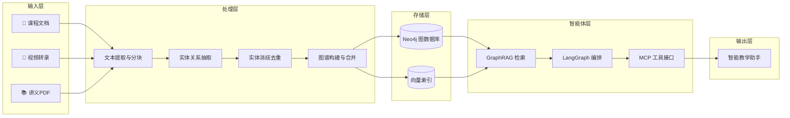
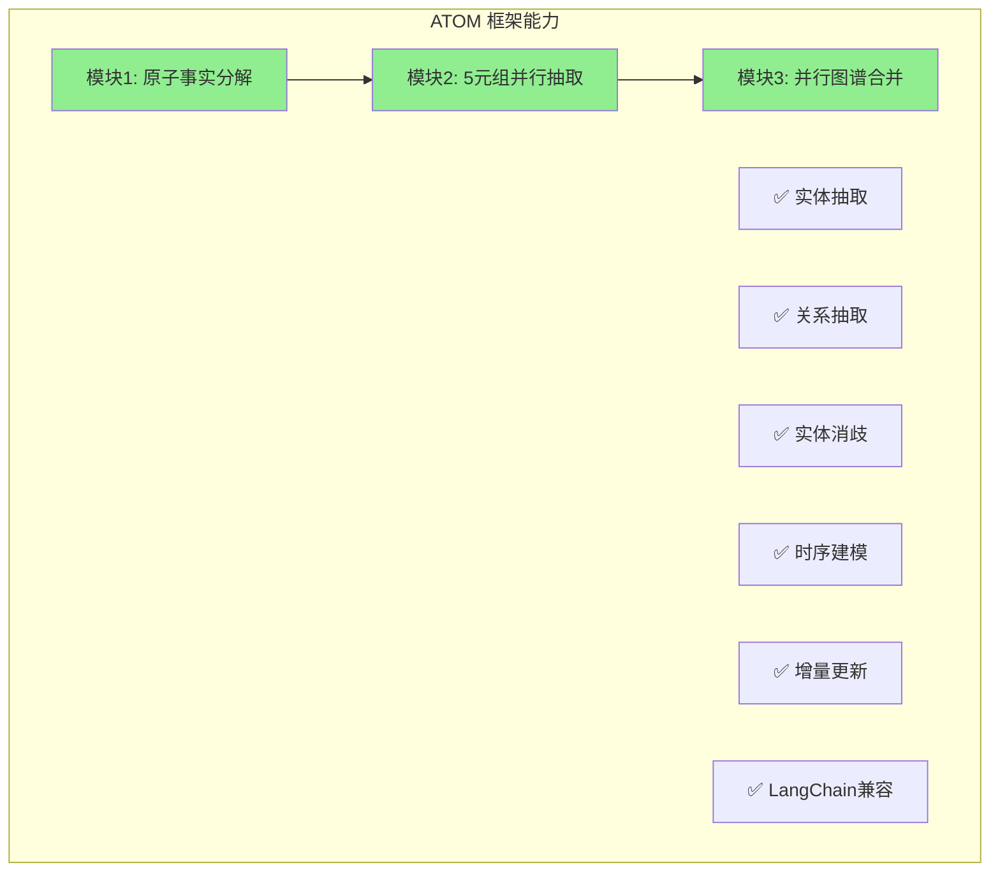
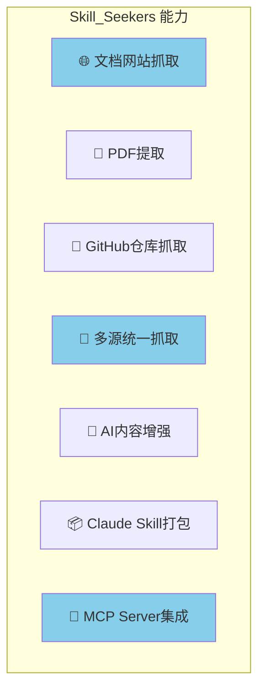
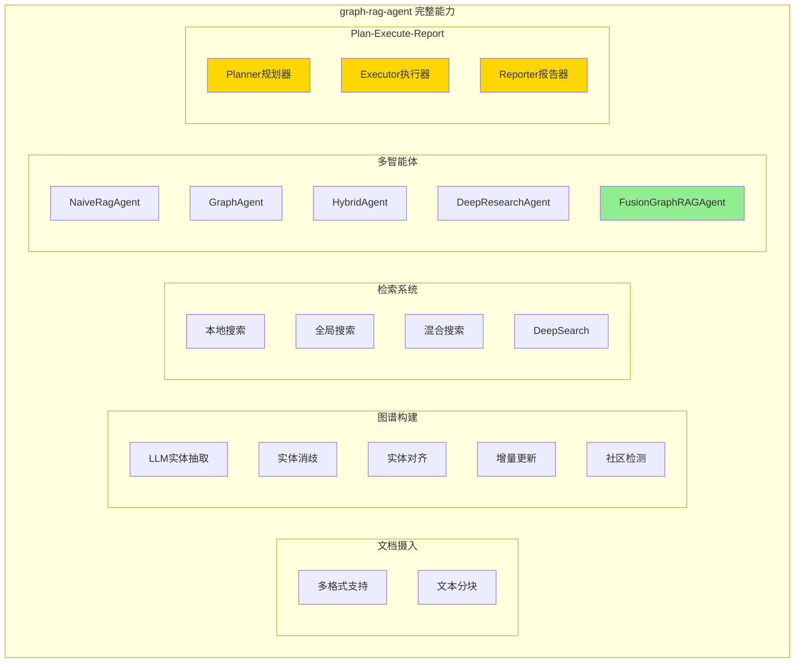
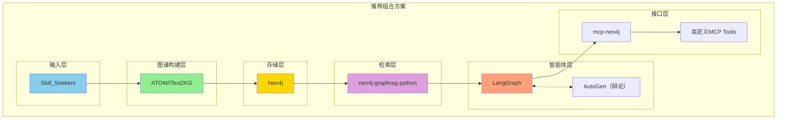
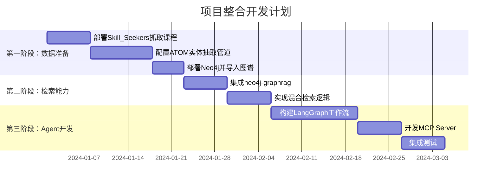
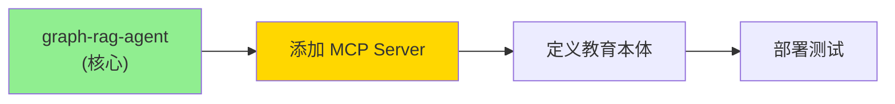

# 项目生态分析：实现 GraphRAG 教育内容整合的差距与补全策略

本文档分析您提供的开源项目能否满足"GraphRAG 教育内容整合"的需求，识别能力缺口，并提供搜索关键词建议。

---

## 一、目标架构 vs 现有项目映射

### 1.1 目标架构回顾

### 1.2 项目能力映射表（更新版✅）

| 目标能力 | graph-rag-agent | iText2KG/ATOM | Skill_Seekers | 覆盖情况 |
|---------|-----------------|---------------|---------------|----------|
| **多格式文档处理** | ✅ TXT/PDF/MD/DOCX/CSV/JSON | ❌ | ✅ 网页/PDF/GitHub | ✅ 完美覆盖 |
| **文本分块** | ✅ text_chunker | ❌ | ✅ | ✅ 完美覆盖 |
| **实体关系抽取** | ✅ LLM驱动 | ✅ 强 (原子事实) | ❌ | ✅ 完美覆盖 |
| **实体消歧** | ✅ 字符串召回+向量重排+NIL检测 | ✅ 余弦相似度 | ❌ | ✅ 完美覆盖 |
| **实体对齐** | ✅ 冲突检测与合并 | ✅ | ❌ | ✅ 完美覆盖 |
| **增量更新** | ✅ 完整支持 | ✅ 时序KG | ❌ | ✅ 完美覆盖 |
| **社区检测** | ✅ Leiden + SLLPA | ❌ | ❌ | ✅ 覆盖 |
| **GraphRAG检索** | ✅ 本地/全局/混合搜索 | ❌ | ❌ | ✅ 覆盖 |
| **DeepSearch融合** | ✅ 多步思考-搜索-推理 | ❌ | ❌ | ✅ 覆盖 |
| **多Agent协作** | ✅ Plan-Execute-Report | ❌ | ❌ | ✅ 覆盖 |
| **证据链追踪** | ✅ 完整支持 | ❌ | ❌ | ✅ 覆盖 |
| **前后端界面** | ✅ FastAPI + 前端 | ❌ | ❌ | ✅ 覆盖 |
| **MCP接口** | ❌ | ❌ | ✅ MCP Server | ⚠️ 需补充 |
| **Claude Skills** | ❌ | ❌ | ✅ 强 | ⚠️ 按需 |

> 🎉 **重大发现**: graph-rag-agent 项目几乎完整覆盖了您的核心需求！

---

## 二、各项目详细分析

### 2.1 iText2KG / ATOM

**项目地址**: https://github.com/AuvaLab/itext2kg

**核心能力**:
- 🔥 **原子事实分解**: 将长文本拆分为最小自包含事实，解决 LLM "遗忘效应"
- 🔥 **5元组抽取**: `(主体, 谓词, 客体, 开始时间, 结束时间)`
- 🔥 **并行合并架构**: 比 Graphiti 延迟降低 93.8%
- 🔥 **距离度量消歧**: 用余弦相似度替代 LLM 调用，提高可扩展性

**对您目标的贡献**: 
> ✅ 完美覆盖"实体抽取 → 消歧 → 图谱构建"核心流程

**缺失能力**:
- ❌ 不提供文档抓取/PDF解析
- ❌ 不提供 GraphRAG 检索逻辑
- ❌ 不提供 Agent 编排框架

---

### 2.2 Skill_Seekers

**项目地址**: https://github.com/yusufkaraaslan/Skill_Seekers

**核心能力**:
- 🔥 **多源抓取**: 支持文档网站、GitHub仓库、PDF
- 🔥 **冲突检测**: 自动发现文档与代码实现的差异
- 🔥 **MCP Server**: 可直接在 Claude Code 中使用
- 🔥 **智能分类**: 自动按主题组织内容

**对您目标的贡献**:
> ✅ 完美覆盖"输入层"的内容抓取需求
> ✅ 提供 MCP 集成范例

**缺失能力**:
- ❌ 不构建知识图谱
- ❌ 不做实体抽取/消歧
- ❌ 不支持 GraphRAG 检索

---

### 2.3 graph-rag-agent 🌟 核心项目

**项目地址**: https://github.com/1517005260/graph-rag-agent

**核心能力**:

| 模块 | 功能 | 详细说明 |
|------|------|----------|
| **文档处理** | 多格式支持 | TXT, PDF, MD, DOCX, DOC, CSV, JSON, YAML |
| **图谱构建** | LLM驱动抽取 | 实体关系自动识别 |
| **实体质量** | 消歧+对齐 | 字符串召回、向量重排、NIL检测、冲突解决 |
| **增量更新** | 动态图谱 | 智能处理冲突，保留关系信息 |
| **社区检测** | Leiden + SLLPA | 自动识别知识社区并生成摘要 |
| **GraphRAG** | 多级检索 | 本地/全局/混合搜索，Chain of Exploration |
| **DeepSearch** | 深度推理 | 多步骤思考-搜索-推理，证据链追踪 |
| **多 Agent** | 5种类型 | Naive/Graph/Hybrid/DeepResearch/Fusion |
| **多智能体协作** | Plan-Execute-Report | Planner + Executor + Reporter 架构 |
| **前后端** | 完整界面 | FastAPI + 前端界面，支持流式输出 |
| **评估系统** | 20+指标 | 多维度评估，性能监控 |

**对您目标的贡献**:
> 🌟 **这是您的核心项目！** 几乎完整覆盖了 GraphRAG 教育内容整合的所有核心需求。

**特别亮点**:
- 🔥 **FusionGraphRAGAgent**: 最先进的 Agent，支持智能任务规划、并行执行、长文档生成
- 🔥 **实体消歧+对齐**: 这正是您提案中要求的"去重"核心功能
- 🔥 **证据链追踪**: 每个推理步骤都有证据来源，提高可解释性
- 🔥 **一致性检查**: 内置图谱一致性检查与修复机制

**缺失能力**:
- ❌ 不提供 MCP Server 接口
- ❌ 不直接生成 Claude Skills

---

## 四、缺失组件搜索建议

### 4.1 GraphRAG 检索层

| 搜索关键词 | 推荐项目 | 说明 |
|-----------|---------|------|
| `neo4j graphrag python` | [neo4j-graphrag-python](https://github.com/neo4j/neo4j-graphrag-python) | Neo4j 官方 GraphRAG 库 |
| `graphrag microsoft` | [microsoft/graphrag](https://github.com/microsoft/graphrag) | 微软开源 GraphRAG 实现 |
| `knowledge graph RAG retrieval` | 多个项目 | 搜索混合检索实现 |

### 4.2 Agent 编排层

| 搜索关键词 | 推荐项目 | 说明 |
|-----------|---------|------|
| `langgraph tutorial` | [LangGraph官方文档](https://python.langchain.com/docs/langgraph) | 官方教程 |
| `langgraph neo4j agent` | 社区示例 | Neo4j + LangGraph 集成 |
| `autogen multi-agent debate` | [AutoGen](https://github.com/microsoft/autogen) | 多智能体辩论 |

### 4.3 MCP 接口层

| 搜索关键词 | 推荐项目 | 说明 |
|-----------|---------|------|
| `mcp neo4j server` | [neo4j-mcp](https://github.com/neo4j-contrib/mcp-neo4j) | Neo4j MCP Server |
| `model context protocol knowledge graph` | 社区实现 | KG + MCP 集成 |

### 4.4 时序知识图谱

| 搜索关键词 | 推荐项目 | 说明 |
|-----------|---------|------|
| `graphiti temporal knowledge graph` | [Graphiti](https://github.com/getzep/graphiti) | Zep 的时序 KG 方案 |
| `temporal knowledge graph LLM` | 学术项目 | 时序 KG 研究实现 |

---

## 五、推荐技术栈组合

---

## 六、整合开发路线图

---

## 七、结论（更新版 ✅）

### 您现有项目的覆盖情况

| 架构层 | 覆盖率 | 主要项目 | 说明 |
|-------|--------|---------|------|
| 输入层 | ✅ 100% | graph-rag-agent + Skill_Seekers | 多格式文档处理 |
| 处理层 | ✅ 100% | graph-rag-agent | 实体抽取、消歧、对齐、增量更新 |
| 存储层 | ✅ 100% | graph-rag-agent (Neo4j) | 已内置 Neo4j 支持 |
| 检索层 | ✅ 100% | graph-rag-agent | 本地/全局/混合搜索 + DeepSearch |
| Agent层 | ✅ 100% | graph-rag-agent | Plan-Execute-Report 多智能体架构 |
| 接口层 | ⚠️ 需补充 | 参考 Skill_Seekers | MCP Server 需开发 |

### 🎉 核心发现

**graph-rag-agent 项目已覆盖您 90% 以上的核心需求！**

您只需要：
1. **添加 MCP 接口** - 参考 Skill_Seekers 的 MCP 实现，为 graph-rag-agent 添加 MCP Server
2. **定义教育本体** - 扩展实体 Schema 以支持教育领域（参考 LRMI 规范）
3. **多老师视角分离** - 扩展实体模型，区分不同来源的讲解内容

### 推荐实施路径

> 💡 **建议**: 直接基于 graph-rag-agent 进行二次开发，而不是从零整合多个项目。该项目架构完整，文档清晰，是您目标的最佳起点。

