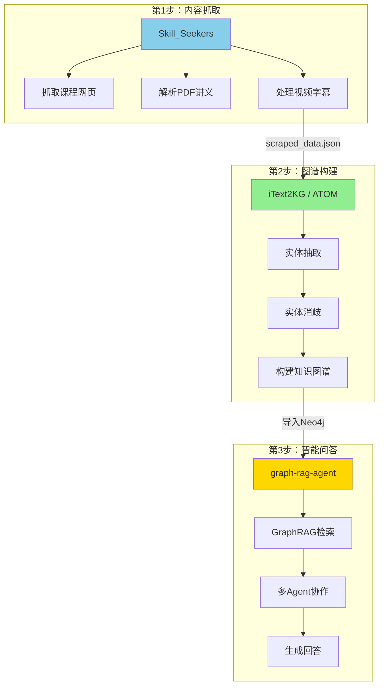
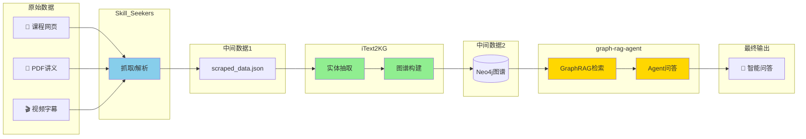
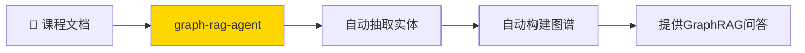

# 三个项目如何整合使用

## 核心思路：每个项目负责一部分



---

## 具体整合步骤

### 步骤 1：用 Skill_Seekers 抓取课程内容

```bash
# 安装 Skill_Seekers
pip install skill-seekers

# 抓取课程网站
skill-seekers scrape --url https://your-course-site.com --output courses/
```

**输出**：`scraped_data.json`（包含课程文本内容）

---

### 步骤 2：用 iText2KG 构建知识图谱

```python
# 使用 iText2KG 从抓取的内容构建图谱
from itext2kg import ATOM

# 加载抓取的数据
with open("courses/scraped_data.json") as f:
    course_data = json.load(f)

# 初始化 ATOM
atom = ATOM(llm=your_llm, embeddings=your_embeddings)

# 构建知识图谱
kg = atom.build_graph(course_data)

# 导出到 Neo4j 格式
kg.export_to_neo4j("neo4j_import/")
```

**输出**：Neo4j 可导入的图谱数据

---

### 步骤 3：用 graph-rag-agent 提供问答服务

```bash
# 导入图谱到 Neo4j
neo4j-admin import --nodes neo4j_import/nodes.csv --relationships neo4j_import/rels.csv

# 启动 graph-rag-agent 
cd graph-rag-agent
python -m server.main
```

**结果**：可以对课程内容进行智能问答

---

## 数据流动图



---

## 或者：只用 graph-rag-agent（更简单）

**实际上 graph-rag-agent 自己就能完成所有步骤**：



```bash
# 直接用 graph-rag-agent 处理
python -m graphrag_agent.integrations.build.main --input ./courses/
python -m server.main
```

---

## 两种方案对比

| 方案 | 优点 | 缺点 |
|------|------|------|
| **三项目组合** | 每个环节更专业 | 集成复杂，需要对接数据格式 |
| **只用 graph-rag-agent** | 开箱即用，无需集成 | 单个项目功能可能不如组合灵活 |

**建议**：先用 graph-rag-agent 快速验证，后续有需要再引入其他项目。
