# GraphRAG 教育内容整合方案图解

本文档用简单的图表解释"基于 GraphRAG 与多智能体协同的异构教育内容深度整合"提案的核心概念。

---

## 一、核心问题：为什么需要这个方案？

### 1.1 现实场景

假设您有一个在线教育平台，有多位老师讲授相同主题的课程：

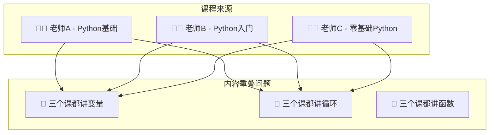

**问题**：内容大量重复，但每位老师又有自己独特的讲解角度。如何既去除重复，又保留各自的特色？

---

## 二、传统方案 vs GraphRAG 方案

### 2.1 传统向量 RAG 的问题

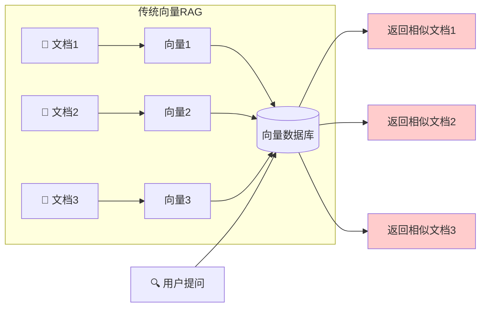

> [!WARNING]
> **传统方案的三大缺陷**
> 1. **语义去重失效**：三份相似内容都被返回，造成冗余
> 2. **结构性缺失**：无法表达"先学A才能学B"的依赖关系
> 3. **增量维护困难**：删除一个知识点需要重新索引整个库

### 2.2 GraphRAG 的解决思路

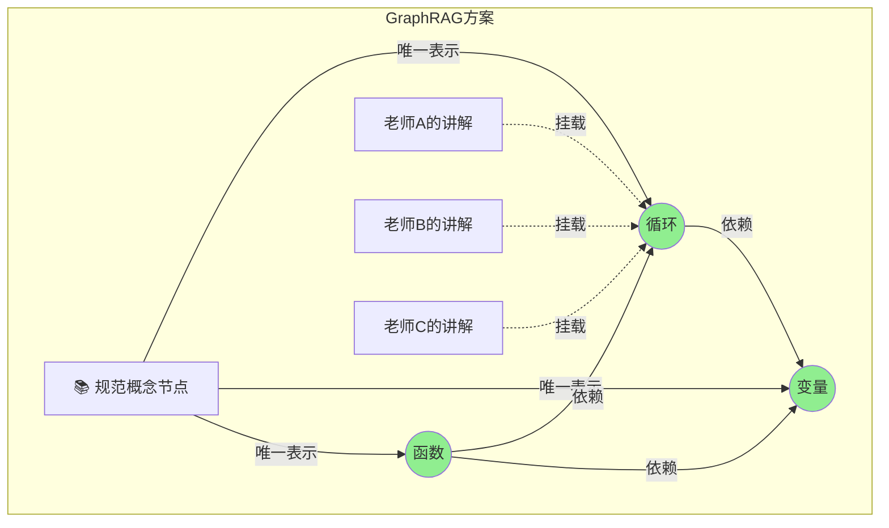

> [!TIP]
> **GraphRAG 核心优势**
> - 知识点只有一份（去重）
> - 不同老师的讲解"挂载"在同一知识点上（保留视角）
> - 节点之间的边表达依赖关系（结构化）

---

## 三、核心架构：知识图谱本体设计

### 3.1 实体类型

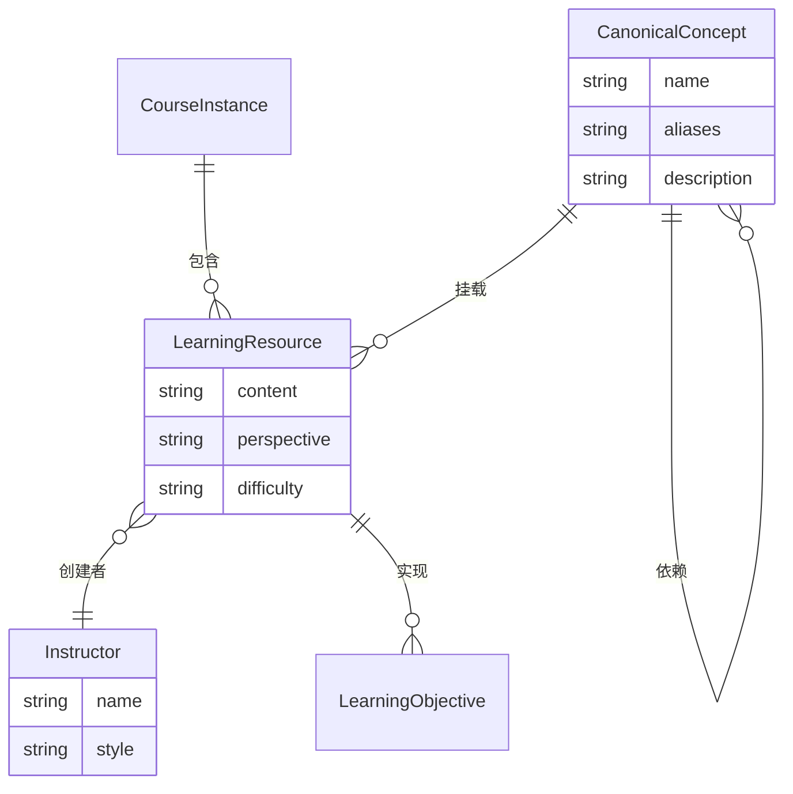

### 3.2 实体关系说明

| 实体类型 | 中文名 | 作用 |
|---------|-------|------|
| `CanonicalConcept` | 规范概念 | 去重的核心，代表唯一的知识点 |
| `LearningResource` | 教学资源 | 具体老师的内容片段，保留不同视角 |
| `Instructor` | 讲师 | 内容的创建者，区分来源 |
| `CourseInstance` | 课程实例 | 特定课程的容器 |
| `Tool` | 工具 | 代码沙箱、计算器等可调用工具 |

---

## 四、智能摄入管道：如何实现去重？

这是整个方案最核心的部分——如何将多位老师的课程自动合并到知识图谱中。

### 4.1 两阶段处理流程

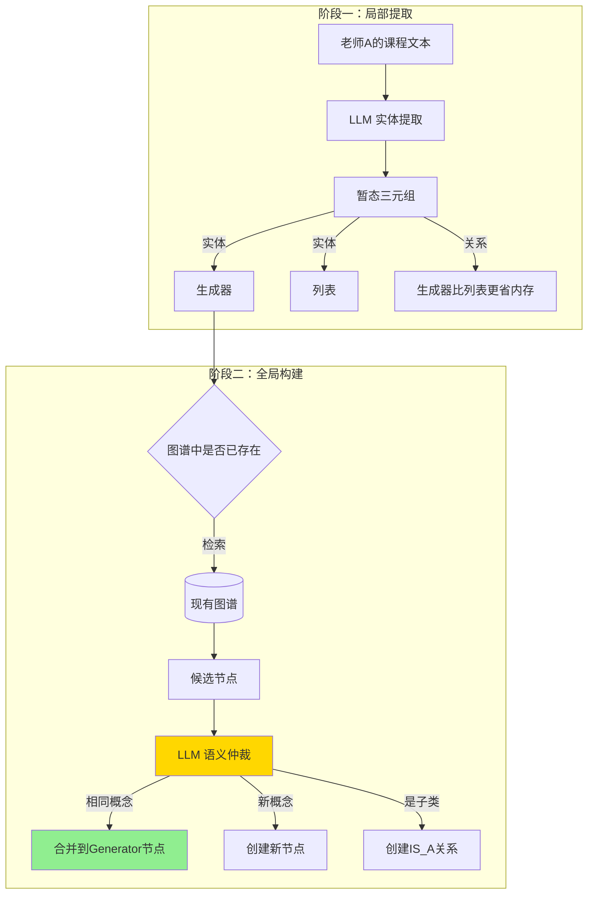

### 4.2 LLM 语义仲裁详解

这是实现"严格去重"的关键步骤：

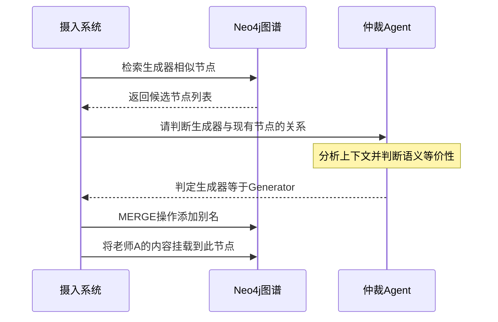

### 4.3 处理教学冲突：多智能体辩论

当不同老师观点冲突时怎么办？

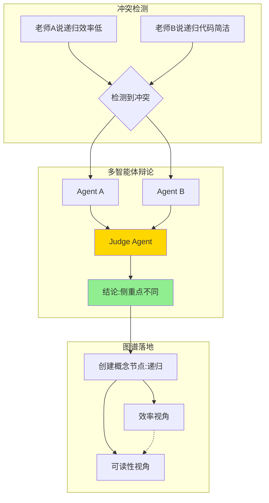

---

## 五、生命周期管理：增量更新与删减

### 5.1 增量更新流程

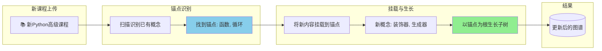

### 5.2 智能删减机制

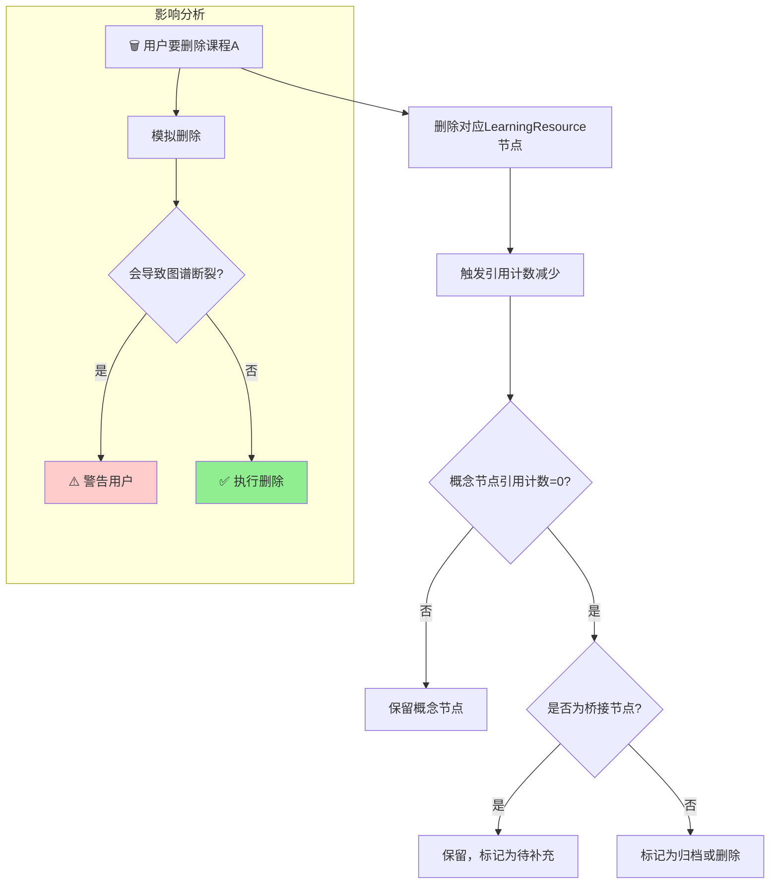

---

## 六、检索与推理：GraphRAG 实战

### 6.1 混合检索策略

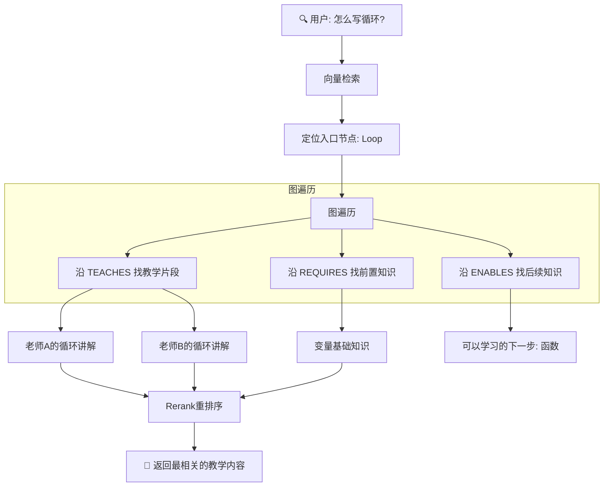

### 6.2 结构化查询示例

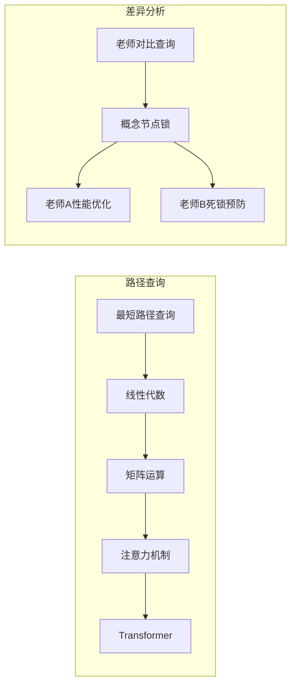

---

## 七、接口层：MCP 与工具集成

### 7.1 MCP 架构

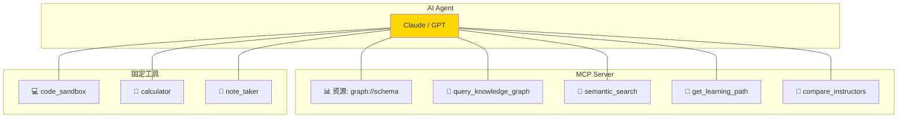

### 7.2 工具调用示例

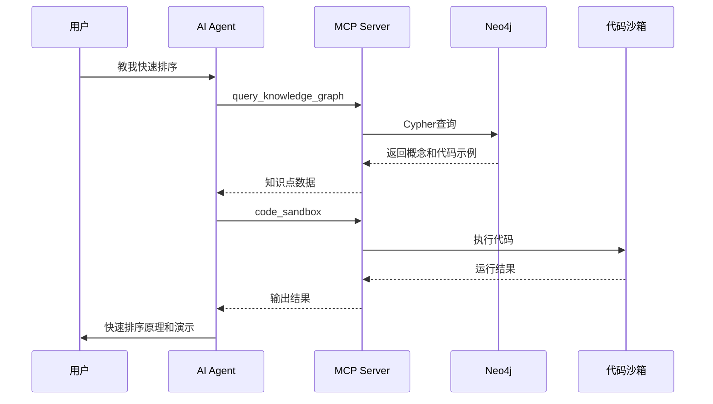

---

## 八、Agent 编排框架选择

### 8.1 LangGraph vs AutoGen

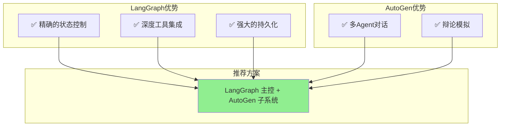

### 8.2 混合架构

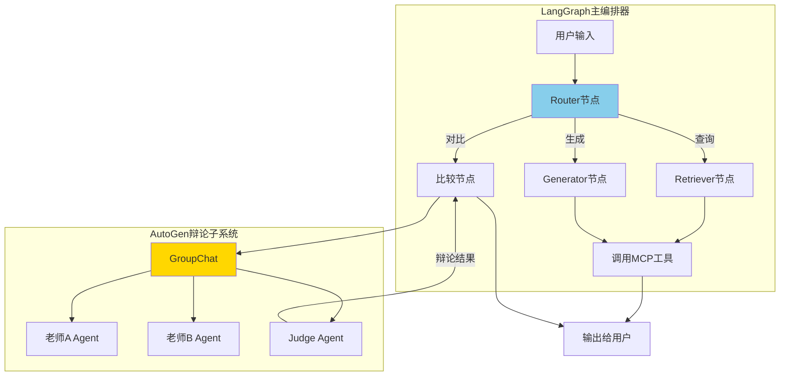

---

## 九、技术栈总览

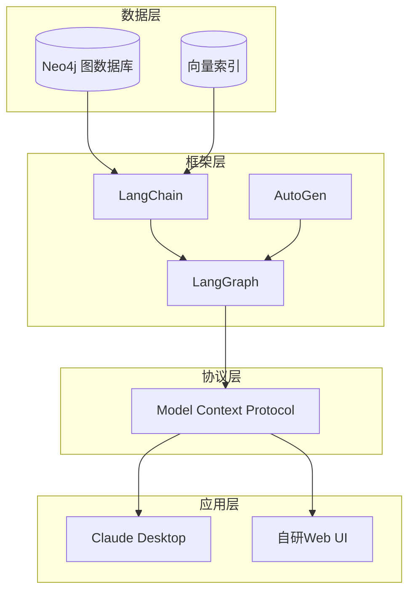

---

## 十、实施路线图

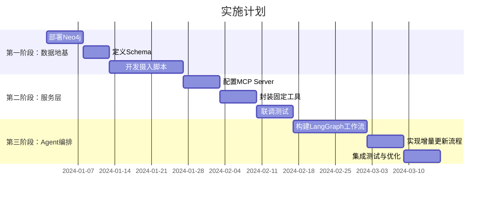

---

## 总结

这个方案的核心思想可以用一句话概括：

> **用知识图谱作为"骨架"实现去重和结构化，用 LLM 作为"大脑"处理语义理解，用 MCP 作为"神经"连接知识与工具，最终形成一个能够智能整合多源教育内容的 AI Agent。**

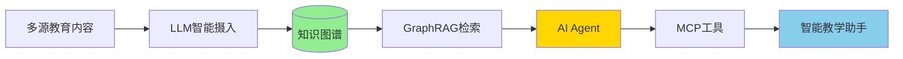
