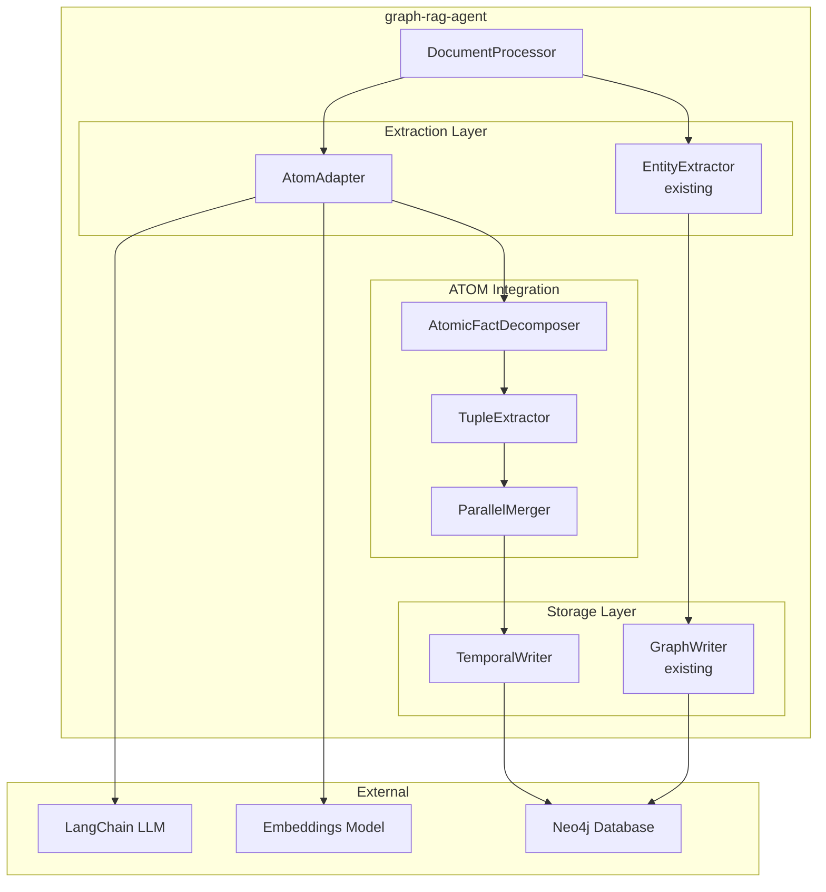

# ATOM Integration Architecture Design

## Overview

本文档描述将 ATOM 时序知识图谱构建能力整合到 graph-rag-agent 的架构设计，采用 Adapter Pattern 保持与现有系统的兼容性。

## System Context



## Component Design

### 1. AtomExtractionAdapter

**职责**：包装 ATOM 并提供统一接口

```python
class AtomExtractionAdapter:
    """
    Adapter for ATOM temporal knowledge graph extraction.
    
    Provides a compatible interface with EntityRelationExtractor
    while leveraging ATOM's parallel architecture.
    """
    
    def __init__(
        self,
        llm_model: BaseChatModel,
        embeddings_model: Embeddings,
        ent_threshold: float = 0.8,
        rel_threshold: float = 0.7,
        max_workers: int = 8,
    ):
        self.atom = Atom(
            llm_model=llm_model,
            embeddings_model=embeddings_model
        )
        # ... configuration
    
    async def extract_from_chunks(
        self,
        chunks: List[TextChunk],
        observation_time: Optional[str] = None,
    ) -> TemporalKnowledgeGraph:
        """
        Extract temporal knowledge graph from text chunks.
        
        Args:
            chunks: Text chunks from document processor
            observation_time: Observation timestamp (defaults to now)
            
        Returns:
            TemporalKnowledgeGraph with entities and temporal relations
        """
        # 1. Atomic fact decomposition (per chunk)
        atomic_facts = await self._decompose_to_facts(chunks)
        
        # 2. Build atomic TKG
        kg = await self.atom.build_graph(
            atomic_facts=atomic_facts,
            obs_timestamp=observation_time or self._current_timestamp(),
            ent_threshold=self.ent_threshold,
            rel_threshold=self.rel_threshold,
            max_workers=self.max_workers,
        )
        
        # 3. Convert to graph-rag-agent format
        return self._convert_to_temporal_kg(kg)
    
    async def incremental_update(
        self,
        new_chunks: List[TextChunk],
        existing_kg: TemporalKnowledgeGraph,
        observation_time: str,
    ) -> TemporalKnowledgeGraph:
        """
        Incrementally update existing KG with new data.
        """
        ...
```

### 2. TemporalKnowledgeGraph Model

**职责**：扩展现有模型以支持时序属性

```python
@dataclass
class TemporalRelationship:
    """
    Relationship with temporal validity.
    
    ATOM's 5-tuple: (subject, predicate, object, t_start, t_end)
    with additional t_obs for observation time.
    """
    source_id: str
    target_id: str
    type: str
    properties: Dict[str, Any]
    
    # Temporal attributes (ATOM specific)
    t_obs: List[float]  # Observation times (UNIX timestamp)
    t_start: List[float]  # Validity start times
    t_end: List[float]  # Validity end times (empty = ongoing)
    
    # Source tracking
    atomic_facts: List[str]  # Original atomic facts
    confidence: float = 1.0

@dataclass  
class TemporalKnowledgeGraph:
    """
    Knowledge graph with temporal support.
    
    Extends ATOM's KnowledgeGraph with graph-rag-agent compatibility.
    """
    entities: List[Entity]
    relationships: List[TemporalRelationship]
    
    # Metadata
    created_at: datetime
    last_updated: datetime
    observation_times: List[float]
    
    def to_graph_documents(self) -> List[GraphDocument]:
        """Convert to LangChain GraphDocument format."""
        ...
    
    @classmethod
    def from_atom_kg(cls, atom_kg: AtomKnowledgeGraph) -> 'TemporalKnowledgeGraph':
        """Convert from ATOM's KnowledgeGraph format."""
        ...
```

### 3. Neo4jTemporalWriter

**职责**：存储时序知识图谱到 Neo4j

```python
class Neo4jTemporalWriter(GraphWriter):
    """
    Extended GraphWriter for temporal knowledge graphs.
    
    Stores ATOM's temporal properties in Neo4j.
    """
    
    def write_temporal_kg(
        self,
        kg: TemporalKnowledgeGraph,
        merge_strategy: str = 'update',
    ):
        """
        Write temporal KG to Neo4j.
        
        Temporal properties stored:
        - atom_t_obs: observation times
        - atom_t_start: validity start times
        - atom_t_end: validity end times
        - atom_atomic_facts: source atomic facts
        
        Args:
            kg: Temporal knowledge graph
            merge_strategy: 'update' (merge times) or 'replace'
        """
        ...
    
    def _create_temporal_relationship_query(
        self,
        rel: TemporalRelationship,
    ) -> str:
        """
        Generate Cypher for temporal relationship.
        
        Example:
        ```cypher
        MATCH (s {id: $source_id}), (t {id: $target_id})
        MERGE (s)-[r:$type]->(t)
        SET r.atom_t_obs = r.atom_t_obs + $t_obs
        SET r.atom_t_start = COALESCE(r.atom_t_start, []) + $t_start
        SET r.atom_t_end = COALESCE(r.atom_t_end, []) + $t_end
        SET r.atom_atomic_facts = COALESCE(r.atom_atomic_facts, []) + $facts
        ```
        """
        ...
```

## Data Flow

### Extraction Flow

```
┌─────────────┐     ┌────────────────────────────────────┐
│  Documents  │────▶│     DocumentProcessor              │
└─────────────┘     │  (file_reader + text_chunker)      │
                    └─────────────┬──────────────────────┘
                                  │ chunks
                                  ▼
┌─────────────────────────────────────────────────────────┐
│                AtomExtractionAdapter                     │
│                                                          │
│  ┌─────────────────────────────────────────────────┐   │
│  │ Module-1: Atomic Fact Decomposition             │   │
│  │ Input: chunks (≤400 tokens each)                │   │
│  │ Output: atomic_facts[]                          │   │
│  └─────────────────────┬───────────────────────────┘   │
│                        │                                 │
│  ┌─────────────────────▼───────────────────────────┐   │
│  │ Module-2: 5-Tuple Extraction (Parallel)         │   │
│  │ Input: atomic_facts + obs_timestamp             │   │
│  │ Output: atomic_kgs[] (one per fact)             │   │
│  └─────────────────────┬───────────────────────────┘   │
│                        │                                 │
│  ┌─────────────────────▼───────────────────────────┐   │
│  │ Module-3: Parallel Atomic Merge                 │   │
│  │ Binary merge: O(log n) parallel reduction       │   │
│  │ Thresholds: ent_θ=0.8, rel_θ=0.7               │   │
│  │ Output: merged_kg                               │   │
│  └─────────────────────────────────────────────────┘   │
│                                                          │
└──────────────────────────┬──────────────────────────────┘
                           │ TemporalKnowledgeGraph
                           ▼
┌─────────────────────────────────────────────────────────┐
│               Neo4jTemporalWriter                        │
│  - Batch node creation                                   │
│  - Temporal relationship merge                           │
│  - Properties: t_obs, t_start, t_end, atomic_facts      │
└─────────────────────────────────────────────────────────┘
```

### Incremental Update Flow

```
┌──────────────┐     ┌───────────────┐
│ New Documents│────▶│ AtomAdapter   │
└──────────────┘     │ extract()     │
                     └───────┬───────┘
                             │ new_atomic_kg
                             ▼
┌──────────────────────────────────────────────────────┐
│              Parallel Atomic Merge                    │
│                                                       │
│  existing_kg ──┬──▶ Entity Resolution (θ=0.8)        │
│  new_atomic_kg─┘   Relation Resolution (θ=0.7)       │
│                    Temporal Resolution (merge times) │
│                                                       │
│  Output: merged_kg with extended temporal history    │
└──────────────────────────────────────────────────────┘
```

## Configuration

### New Settings

```python
# graphrag_agent/config/settings.py

# ATOM Configuration
ATOM_ENABLED = os.getenv("ATOM_ENABLED", "false").lower() == "true"
ATOM_ENTITY_THRESHOLD = float(os.getenv("ATOM_ENTITY_THRESHOLD", "0.8"))
ATOM_RELATION_THRESHOLD = float(os.getenv("ATOM_RELATION_THRESHOLD", "0.7"))
ATOM_MAX_WORKERS = int(os.getenv("ATOM_MAX_WORKERS", "8"))
ATOM_ENTITY_NAME_WEIGHT = float(os.getenv("ATOM_ENTITY_NAME_WEIGHT", "0.8"))
ATOM_ENTITY_LABEL_WEIGHT = float(os.getenv("ATOM_ENTITY_LABEL_WEIGHT", "0.2"))
```

### .env Example

```bash
# ATOM Temporal KG Settings
ATOM_ENABLED=true
ATOM_ENTITY_THRESHOLD=0.8
ATOM_RELATION_THRESHOLD=0.7
ATOM_MAX_WORKERS=8
```

## Trade-offs and Decisions

### Decision 1: Adapter Pattern vs. Direct Replacement

**Chosen**: Adapter Pattern

**Rationale**:
- 保持向后兼容性
- 允许逐步迁移
- 便于 A/B 测试性能
- 降低集成风险

**Trade-off**:
- 增加一层抽象
- 可能有轻微性能开销

### Decision 2: Storage Strategy

**Chosen**: Extend existing Neo4j schema with `atom_` prefixed properties

**Rationale**:
- 避免 schema 冲突
- 支持混合模式（部分数据有时序，部分没有）
- 便于清理/回滚

**Trade-off**:
- 属性名较长
- 查询需要考虑属性存在性

### Decision 3: Async vs Sync API

**Chosen**: Async API (following ATOM's design)

**Rationale**:
- ATOM 原生支持 async
- 更好的 I/O 并发性
- 与 LangChain async patterns 一致

**Trade-off**:
- 调用方需要 async runtime
- 增加复杂性

## Testing Strategy

### Unit Tests
- `test_atom_adapter.py`: 适配器功能测试
- `test_temporal_kg.py`: 时序模型转换测试
- `test_temporal_writer.py`: Neo4j 写入测试

### Integration Tests
- 端到端文档处理流程
- 增量更新测试
- Neo4j 数据验证

### Performance Tests
- 对比现有提取器和 ATOM 提取器
- 测量延迟改进
- 验证并行效率
