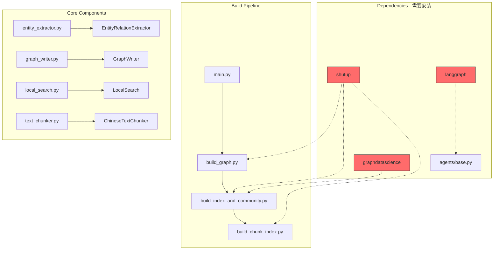

# Design Document - Fix E2E Testing Issues

## Overview

本文档详细说明 GraphRAG 项目端到端测试修复的技术设计决策。

## Architecture Context



## Design Decisions

### 1. 依赖安装策略

**决策**: 直接安装缺失依赖而非添加可选导入保护

**理由**:
- `shutup` 是构建模块必需的依赖
- `langgraph` 是 Agent 系统的核心依赖
- `graphdatascience` 是社区检测的必需依赖
- 这些依赖已在 `requirements.txt` 中声明，只是未正确安装

**安装命令**:

```bash
pip install shutup==0.2.0 langgraph==0.3.18 graphdatascience==1.12
```

### 2. 模块导出策略

**决策**: 在 `__init__.py` 中统一导出常用类

**理由**:
- 简化导入路径
- 提供稳定的公共 API
- 隐藏内部实现细节

**实现**:

```python
# graphrag_agent/graph/extraction/__init__.py
from .entity_extractor import EntityRelationExtractor
from .graph_writer import GraphWriter
from .atom_adapter import AtomExtractionAdapter
from .temporal_writer import Neo4jTemporalWriter

__all__ = [
    'EntityRelationExtractor',
    'GraphWriter',
    'AtomExtractionAdapter', 
    'Neo4jTemporalWriter'
]
```

### 3. 类名别名策略

**决策**: 为 `ChineseTextChunker` 提供 `TextChunker` 别名

**理由**:
- 向后兼容可能存在的旧代码
- `TextChunker` 是更通用的命名
- 不改变现有实现

**实现**:

```python
# graphrag_agent/pipelines/ingestion/text_chunker.py
class ChineseTextChunker:
    """中文文本分块器"""
    ...

# 兼容别名
TextChunker = ChineseTextChunker
```

## Error Handling Matrix

| 场景 | 当前行为 | 修复后行为 |
|------|----------|------------|
| 缺少 shutup | `ModuleNotFoundError` 崩溃 | 安装后正常运行 |
| 缺少 langgraph | `ModuleNotFoundError` 崩溃 | 安装后正常运行 |
| 缺少 graphdatascience | `ModuleNotFoundError` 崩溃 | 安装后正常运行 |
| 错误导入路径 | `ImportError` | 正确导入，有 `__all__` 导出 |

## File Structure After Changes

```
graphrag_agent/
├── agents/
│   ├── __init__.py
│   └── base.py                    # 依赖 langgraph
├── graph/
│   ├── core/
│   │   └── __init__.py
│   └── extraction/
│       ├── __init__.py            # 更新导出
│       ├── entity_extractor.py
│       └── graph_writer.py
├── integrations/
│   └── build/
│       ├── build_graph.py         # 依赖 shutup
│       ├── build_index_and_community.py  # 依赖 graphdatascience
│       └── build_chunk_index.py
├── pipelines/
│   └── ingestion/
│       └── text_chunker.py        # 添加 TextChunker 别名
└── search/
    ├── __init__.py                # 更新导出
    └── local_search.py
```

## Testing Strategy

### Dependency Tests

```python
def test_required_dependencies():
    """验证所有必需依赖已安装"""
    import shutup
    import langgraph
    import graphdatascience
    # 应该不抛出异常
```

### Import Tests

```python
def test_module_imports():
    """验证模块导入路径正确"""
    from graphrag_agent.graph.extraction import EntityRelationExtractor, GraphWriter
    from graphrag_agent.search import LocalSearch
    from graphrag_agent.pipelines.ingestion.text_chunker import TextChunker
    # 应该不抛出异常
```

### Integration Tests

- Mock LLM/Embeddings/Neo4j 运行完整构建流程
- 验证各阶段日志输出正确
- 验证查询返回预期格式

## Rollback Plan

如果修复引入问题：

1. 卸载可能冲突的依赖版本
2. 恢复原始 `__init__.py` 导出
3. 移除 `TextChunker` 别名

所有修改都是向后兼容的，回滚风险低。
