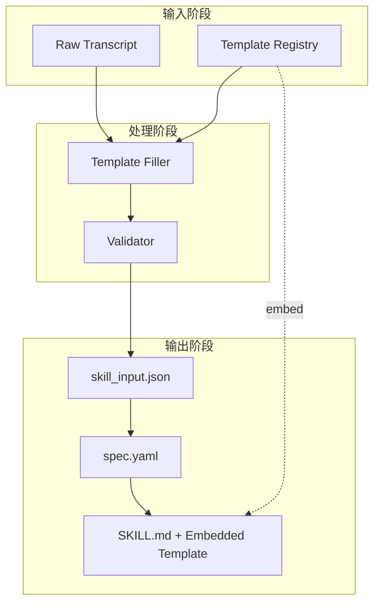

# Design: Dynamic Template Mechanism

## Architecture Overview



## Key Design Decisions

### D1: skill_input.json Structure

采用 4 层结构：

```json
{
  "template": {
    "id": "transcript-segmented",
    "name": "分段转录模板",
    "version": "1.0.0",
    "segments": [
      {
        "key": "context",
        "title": "背景信息",
        "required": true,
        "inputs": [{"type": "transcript", "selector": {"range": [0, 1]}}],
        "format": "markdown"
      },
      {
        "key": "key_points",
        "title": "核心要点",
        "required": true,
        "repeatable": true,
        "transform": {"type": "list-extract", "instructions": "提取要点"}
      }
    ]
  },
  "content": {
    "status": "complete",
    "segments": {
      "context": {"value": "..."},
      "key_points": [{"value": "要点1"}, {"value": "要点2"}]
    }
  },
  "source": {
    "transcript_refs": [{"file": "lecture.md", "segments": [0, 10]}],
    "metadata": {"speaker": "instructor", "locale": "zh-CN"}
  },
  "trace": {
    "generated_at": "2024-12-18T00:00:00Z",
    "template_version_used": "1.0.0"
  }
}
```

**理由**：分离模板和内容，便于模板复用和版本管理。trace 记录生成过程用于复现。

### D2: Template Segment Schema

每个 segment 包含：

| Field | Type | Required | Description |
|-------|------|----------|-------------|
| key | string | ✓ | 唯一标识符 |
| title | string | ✓ | 显示标题 |
| description | string | | 说明文字 |
| required | boolean | | 是否必填 |
| repeatable | boolean | | 是否可重复 |
| inputs | array | | 数据源定义 |
| transform | object | | 提取/转换指令 |
| format | string | | 输出格式 (markdown/json/plain) |
| constraints | object | | 约束条件 |
| relationships | array | | 依赖的其他 segment |

**理由**：足够灵活支持各种内容类型，同时保持 schema 可验证。

### D3: Template Registry

模板按 `{id}@{version}` 唯一标识，存储在：
- 本地：`templates/{id}/{version}/template.json`
- 技能内：`SKILL.md` 底部 `<!-- TEMPLATE_META: {...} -->` 注释块

**理由**：本地存储便于版本控制，技能内嵌入确保可追溯。

### D4: Migration Strategy

当模板版本更新时：
1. 比较新旧 segments（新增/删除/修改）
2. 生成迁移报告（affected_fields, migration_actions）
3. 在 proposal 中输出迁移建议

**理由**：减少手动对比工作，降低迁移风险。

### D5: Backward Compatibility

当 skill_input.json 无 `template` 字段时：
- 降级为旧逻辑（固定 segmented_summary 格式）
- 日志警告：`Using legacy mode, consider migrating to template-based format`

**理由**：确保现有工作流不中断。

## Module Design

### New Modules

1. **TemplateRegistry**
   - `get_template(id, version)` → Template
   - `list_templates()` → List[TemplateInfo]
   - `register_template(template)` → void

2. **TemplateFiller**
   - `fill(template, raw_content)` → FilledContent
   - `validate(content, template)` → List[ValidationError]

3. **TemplateMigrator**
   - `compare(old_template, new_template)` → MigrationReport
   - `generate_migration_guide(report)` → str

4. **TemplateEmbedder**
   - `embed_in_skill(skill_md, template)` → str
   - `extract_from_skill(skill_md)` → Template | None

## Workflow Changes

### /skill-seekers-proposal

新增步骤：
1. 询问用户选择模板（或使用默认模板）
2. 根据模板定义处理原始内容
3. 生成包含 template + content 的 skill_input.json
4. 如有旧版本，输出迁移建议

### /skill-seekers-apply

新增步骤：
1. 读取 skill_input.json 中的 template
2. 根据 template.segments 生成 spec.yaml sections
3. 在 SKILL.md 末尾嵌入模板元数据
