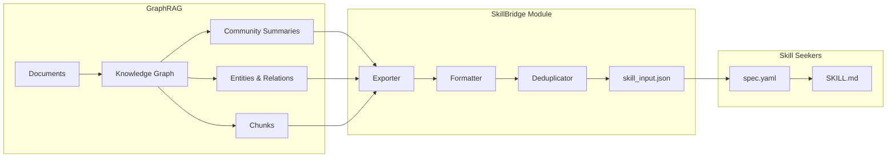

# Design: GraphRAG ↔ Skill Seekers Integration

## Context

The graph-rag-agent project builds knowledge graphs from documents and generates community summaries. Spec_Skill_Seekers converts documentation into Claude AI skills. This design bridges both systems, allowing skills to be generated directly from knowledge graph content.

## Goals / Non-Goals

### Goals
- Enable GraphRAG as a data source for Skill Seekers
- Maintain skill-KG synchronization when graph updates
- Support full export and delta-only export modes
- Integrate with existing `/skill-seekers-*` slash commands

### Non-Goals
- Real-time skill updates (batch processing acceptable)
- Changes to Skill Seekers core library
- Automatic skill deployment to Claude

## Architecture

### High-Level Data Flow



### Module Structure

```
graphrag_agent/
└── integrations/
    └── skill_seekers/
        ├── __init__.py
        ├── exporter.py       # Core export logic
        ├── formatter.py      # Format to skill-compatible JSON
        ├── deduplicator.py   # Entity/content deduplication
        ├── sync_manager.py   # Track KG→Skill sync state
        └── cli.py            # CLI commands integration
```

## Decisions

### D1: Export Format

**Decision**: Export GraphRAG content to a `skill_input.json` file compatible with Skill Seekers' `scraped_data.json` schema.

**Format**:
```json
{
  "source": {
    "type": "graphrag",
    "graph_name": "my-knowledge-graph",
    "export_timestamp": "2024-12-18T12:00:00Z",
    "community_level": 0
  },
  "pages": [
    {
      "title": "Community: Entity Relationships",
      "url": "graphrag://community/123",
      "content": "Community summary text...",
      "content_type": "community_summary",
      "metadata": {
        "community_id": "123",
        "entity_count": 15,
        "relationship_count": 22
      }
    }
  ],
  "entities": [
    {
      "name": "Python",
      "type": "technology",
      "description": "Programming language...",
      "relationships": ["uses:Django", "related_to:FastAPI"]
    }
  ],
  "dedup_report": {
    "original_entity_count": 150,
    "merged_entity_count": 120,
    "merge_groups": [["Python 3", "Python3", "python"]]
  }
}
```

**Rationale**: Mimics `scraped_data.json` structure so Skill Seekers can process it without modification.

### D2: Deduplication Strategy

**Decision**: Apply two-phase deduplication:
1. **Entity-level**: Use existing `SimilarEntityDetector` to merge duplicates
2. **Content-level**: Hash-based deduplication for community summaries

**Rationale**: Leverages existing dedup infrastructure while adding content-level checks.

### D3: Sync Mechanism

**Decision**: Implement a `SyncManager` that tracks:
- Last export timestamp
- Community IDs included in last export
- Delta changes since last export (using `__CommunityDelta__` if DSA enabled)

**Sync modes**:
- `full`: Re-export entire knowledge graph
- `delta`: Export only changed communities since last sync

**Rationale**: Matches DSA architecture for efficient incremental updates.

### D4: Slash Command Integration

**Decision**: Extend `/skill-seekers-proposal` workflow to accept `--source graphrag` parameter.

**Workflow modification**:
```bash
# Existing (unchanged)
skill-seekers scrape --spec-first --output-raw --url <doc_url>

# New option (added)
skill-seekers scrape --spec-first --output-raw --source graphrag \
  --graph-config graphrag_config.yaml \
  --export-mode delta
```

**Rationale**: Minimal workflow change, adds GraphRAG as another source type.

## Component Details

### Exporter

```python
class GraphRAGExporter:
    def __init__(self, graph: Neo4jGraph, config: ExportConfig):
        self.graph = graph
        self.config = config
        
    def export(self, mode: str = "full") -> ExportResult:
        """
        Export knowledge graph to skill-compatible format.
        
        Args:
            mode: "full" or "delta"
        
        Returns:
            ExportResult containing pages, entities, and metadata
        """
        pass
        
    def export_communities(self, level: int = 0) -> List[Dict]:
        """Export community summaries at specified level."""
        pass
        
    def export_entities(self, include_relationships: bool = True) -> List[Dict]:
        """Export deduplicated entities with optional relationships."""
        pass
```

### Formatter

```python
class SkillInputFormatter:
    def format(self, export_result: ExportResult) -> Dict:
        """
        Convert ExportResult to Skill Seekers compatible JSON.
        
        Mapping:
        - Community summaries → pages with content_type="community_summary"
        - Entities → entities array with relationships
        - Chunks → pages with content_type="reference"
        """
        pass
```

### SyncManager

```python
class GraphRAGSkillSyncManager:
    def __init__(self, sync_state_path: str = ".skill_sync_state.json"):
        self.state_path = sync_state_path
        
    def get_pending_updates(self) -> List[str]:
        """Return community IDs changed since last sync."""
        pass
        
    def mark_synced(self, export_result: ExportResult) -> None:
        """Update sync state after successful export."""
        pass
```

## Risk Analysis

| Risk | Mitigation |
|------|------------|
| Large graph export takes too long | Add `--max-communities` limit, async processing |
| Community summaries too verbose for skills | Add summarization post-processing step |
| Skill Seekers API changes break integration | Pin compatible version, add adapter layer |
| Sync state corruption | Add recovery mode, manual resync command |

## Migration Plan

1. **Phase 1**: Add `skill_seekers/` integration module (non-breaking)
2. **Phase 2**: Add `--source graphrag` support to Skill Seekers CLI (requires Skill Seekers update)
3. **Phase 3**: Update `/skill-seekers-proposal` workflow documentation
4. **Phase 4**: Add sync tracking and delta export support

## Open Questions

1. **Q**: Should the exporter run inside GraphRAG pipeline (automatic) or as separate command (manual)?
   - **Tentative**: Separate command, user controls when to export.

2. **Q**: How to handle entity types that don't map cleanly to skill sections?
   - **Tentative**: Allow custom type→section mappings in config.

3. **Q**: Should skills reference original source documents or just KG content?
   - **Tentative**: Include `source_files` metadata but use KG content as primary.
